# ORACLE Cloud-Native DevOps workshop #
-----
## Deploying APM Agent and setting up Application Performance Monitoring ##

### Introduction ###
Oracle Application Performance Monitoring Cloud Service is a software-as-a service solution that provides deep visibility into your application performance from end-user experience, through application server requests, and down to application logs. With Oracle Application Performance Monitoring Cloud Service you can isolate problems before they impact your business, break down the barriers between Development and Operations teams and deliver better applications.


In this tutorial, we will integrate APM into a continuous delivery flow to automatically incorporate the setup and installation of the APM agent during the build process, to ensure that we have continuous telemetry. Using the Application Performance Monitoring Web User Interface you can monitor all necessary details about the demo application.

Once this is setup, the APM will be introduced into the application automatically during the build  and we will be able to get telemetry without further thinking about the process of deploying agents.

### About this tutorial ###
This tutorial demonstrates how to:

+ Access Application Performance Monitoring Cloud Service
+ Download the Agent Master Installer
+ Incorporate APM Agent into an automated DevCS continuous delivery flow
+ Set Up Application Performance Monitoring
+ How to Use Application Performance Monitoring
+ Manually deploy the APM Agent into Apache Tomcat

### Prerequisites ###

+ Oracle Public Cloud Services account including:
	+ Application Performance Monitoring Cloud Service
	+ Application Container Cloud Service
	+ [springboot-sample Tutorial](../springboot-sample/)

### Steps ###

#### Complete the springboot-sample tutorial ####
Complete the [springboot-sample tutorial](../springboot-sample/) to set up a continuous delivery pipeline from source control to ACCS deployment for our sample application.

#### Prepare Notes ####
There will be a number of keys, urls, and URI strings that you will need to keep track of across the setup process. To keep this clear in your head, create a Snippet (in a separate browser window/tab) or a text file with the following template, which we will fill in as we go along.
```
Maven Base URL:
Agent Install Zip Path:

AGENTINSTALL_ZIP_URL:

AGENT_REGISTRATION_KEY:

URI Prefix:
WAR_FILE:
```
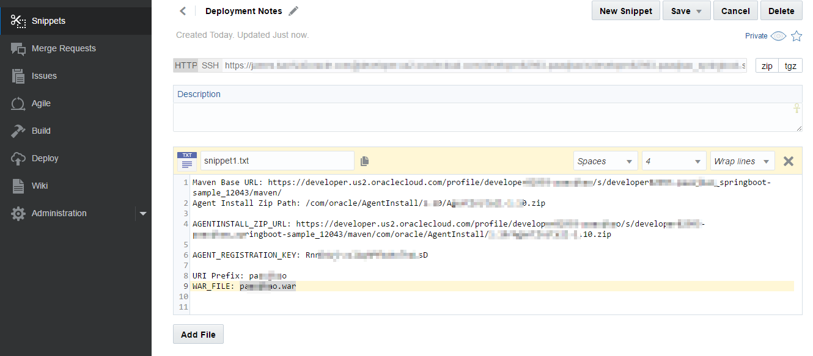

#### Download the Oracle Management Cloud Master Installer & Registration Key ####

The master installer is the starting point for all client-side Oracle Management Cloud components, such as the gateway, Cloud Agent, and APM Agent. In order to integrate APM into our build, we will need to supply this installer to our build process. To do this, we will start by downloading the tenant-specific master installer.

Download the master installer for your tenant and make note of a valid registration key. We will incorporate these into our build process to automatically deploy the agent.

[Sign in](../common/sign.in.to.oracle.cloud.md) to [https://cloud.oracle.com/sign_in](https://cloud.oracle.com) and go to Dashboard Page. Click **Launch APM**.

If you have separate Oracle Management Cloud Service access, for example in case of trial use the proper identity domain and credentials to login.

Once you have reached the Oracle Cloud Management Cloud Welcome page click **Application Navigator** and on the drop down list select **Administration** -> **Agents**
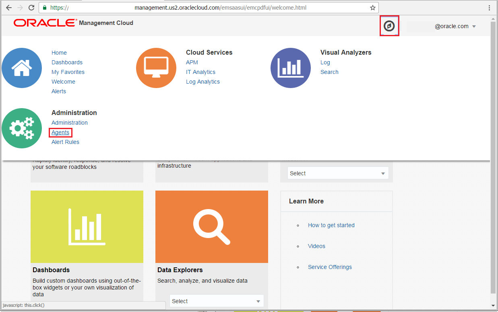

On the left menu select **Download** and click on the green download icon.


Save the AgentInstall.zip file.

Locate a **valid** registration key with a large maximum that we will use for agent deployment. Click **Registration Keys** on the left side menu. Copy-paste your Registration Key value into your notes for AGENT_REGISTRATION_KEY.


#### Upload Build Artifacts to Maven ####
Now that we have downloaded the necessary master installer, we will need to make it available to our automated build process. We will use the DevCS Maven repository for this purpose. By uploading the master installer to the Maven repository, our build scripts will be able to download and use it to integrate the necessary agent components into our application.

Log into the Developer Cloud Service and navigate to the Maven repository's **Upload** page


Upload the AgentInstall.zip that you downloaded previous from the Oracle Management Cloud UI.
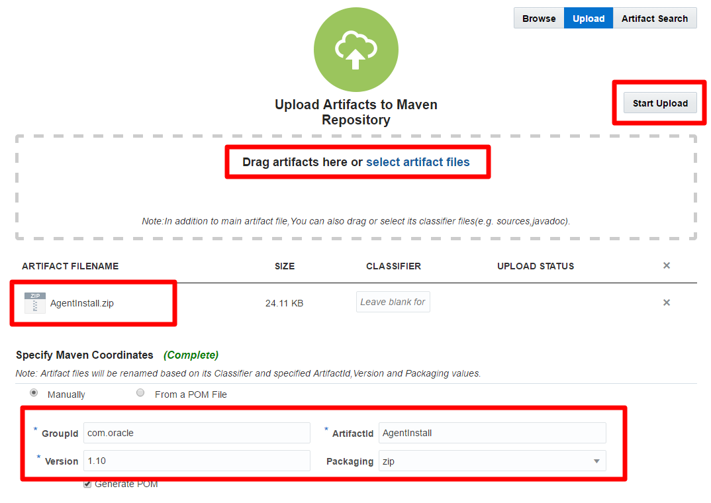

Wait for the upload to complete successfully and then proceed to the next step.
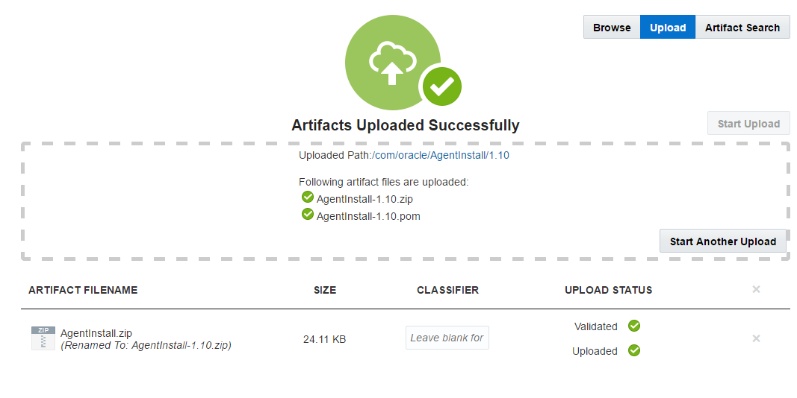

#### Determine the URL for the Maven Artifacts ####
We will need to supply repository download URLs to the build scripts, which we will collect from the UI in this step.

Return to Browse mode and then make note of the repository URL contained with the Distribution Management XML. Copy-paste this URL into your notes as *Maven Base URL*. Then, navigate to our artifact by clicking on the version number in the list of artifact directories.
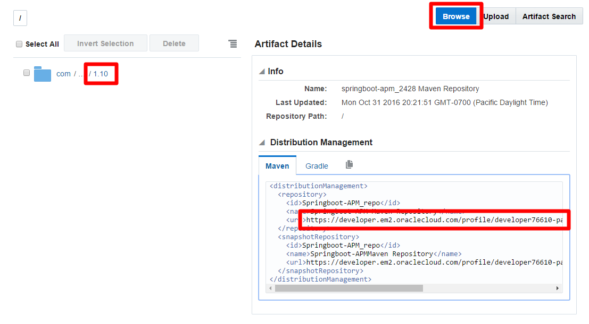

Now we're in the folder for our artifact. Click on the zip file and make note of the repository path. Copy-paste this path into your notes as *Agent Install Zip Path*.
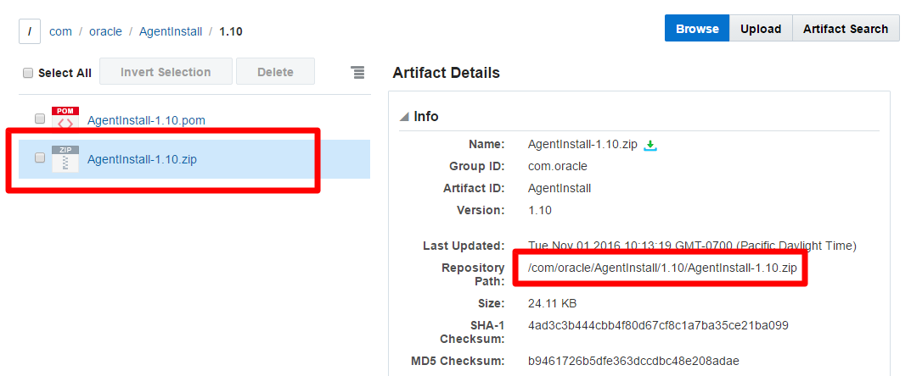

Append the *Agent Install Zip Path* to the end of the *Maven Base URL* that we just wrote down, correcting for any redundant slashes (/) in the full URL. Enter this full URL into your notes as AGENTINSTALL_ZIP_URL.

#### Update the Build ####
Now we'll return to our previous build and modify its configuration to run our APM-enabled build process. The script we are using here will package up the application as a Tomcat server based application and set up the APM agent automatically. The script will call maven to execute the springboot-sample code, and will additionally set up a Tomcat server and integrate APM into the Tomcat server. The deployment model in this case will be a WAR file based deployment, which means that our application will be served by Tomcat under a URI prefix derived from the WAR file name.

First, come up with a short unique string (like your name or tenant identity domain) that will be used as the URI prefix for you application. Enter your chosen string as *URI Prefix* in your notes. Use the prefix as the name of your war file by appending ".war" to the end, like "trial021.war". Record this name as WAR_FILE in your notes.

Return to the `springboot_build` build job and navigate to its **Configure** section. Add a new **Execute shell** build step. Refer back to the full URL to our installer within Maven, the registration key that we collected in the previous steps, and your chose war file name. Substitute them into the appropriate <> within the Command as follows:
```
export AGENTINSTALL_ZIP_URL=<AGENTINSTALL_ZIP_URL from your notes>
export AGENT_REGISTRATION_KEY=<AGENT_REGISTRATION_KEY from your notes>
export WAR_FILE=<WAR_FILE from your notes>
cd apm
./build.sh
```
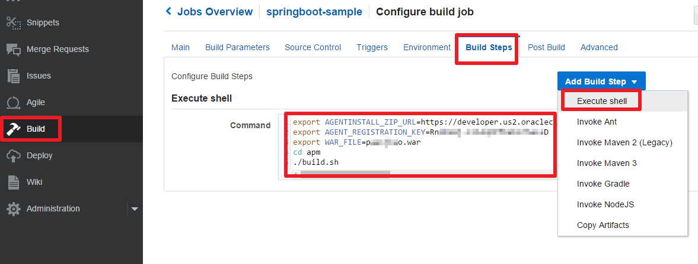

This build script will generate `apm/application.zip`, so we will need to update the **Post Build** configuration appropriately, and then **Save**


Return to our build screen and trigger a build using **Build Now**
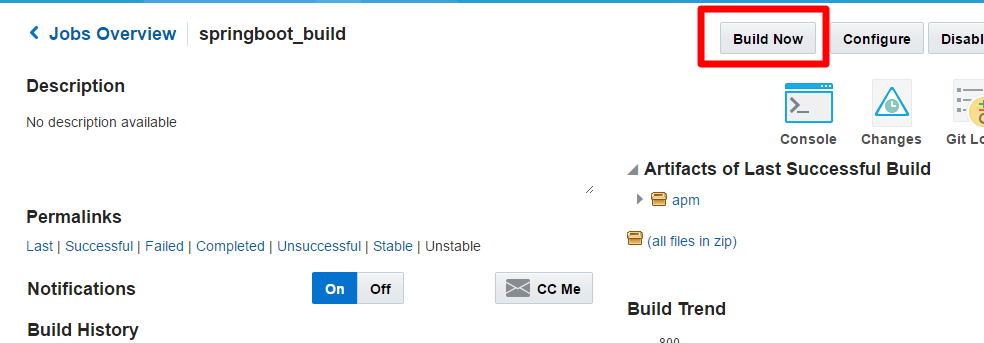

Monitor the progress of the build in the console and wait for the build to complete successfully before moving on.

#### Update the Deploy ####
Since our file to archive has been changed, we will need to update the Deploy configuration to match.
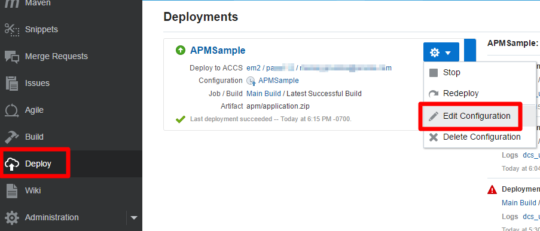

Ensure that `apm/application.zip` is specified as the Artifact. You may need to temporarily flip the **Type** to "On Demand" and pick you most recent build in order for the new artifact to show up, then return the type to "Automatic". Once done, **Save** the configuration.
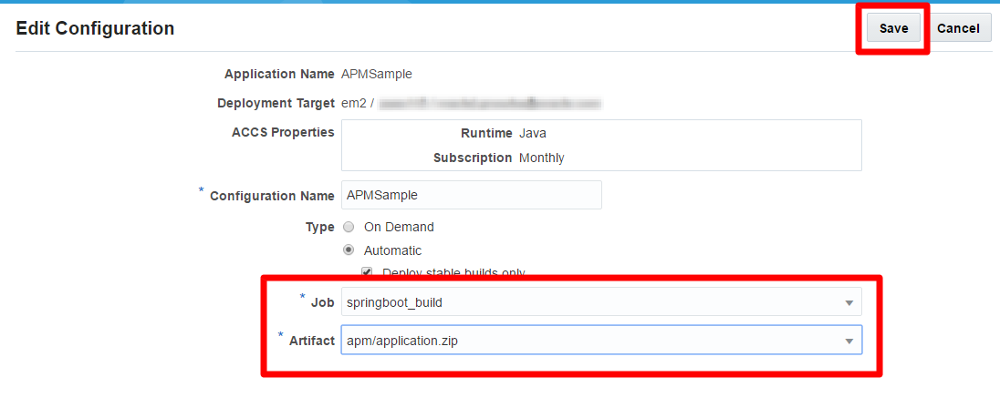

A deployment should be immediately triggered. Monitor its progress and wait for it to complete successfully before proceeding.

#### Validating the Application ####

Now let's make sure that the application deployment was successful and is returning telemetry.

Point your browser at:

```https://<your ACCS URL>/<URI prefix from your notes>```

Verify that the springboot-sample looks the same as it did before.

Next, let's what's going on in the page. In Chrome or Firefox, press Control-Shift-I to bring up the browser inspector. With the inspector open, visit the following URL:

```https://<your ACCS URL>/<URI prefix>/angular.html```

You should land on a sample single-page web app, and see in the Network tab of the inspector that there are calls to `collector`. Those calls represent browser telemetry being returned to APM.
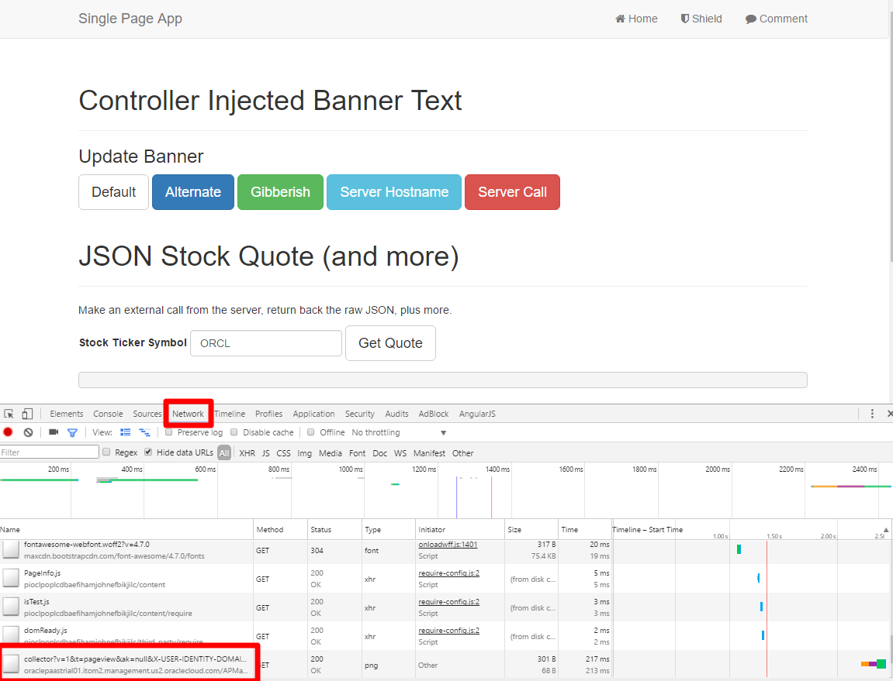

Click on the various samples on this page to see what they do.

#### Set Up Application Performance Monitoring ####

[Sign in](../common/sign.in.to.oracle.cloud.md) to [https://cloud.oracle.com/sign_in](https://cloud.oracle.com) and go to Dashboard Page. Click **Launch APM**.

If you have separate Oracle Management Cloud Service access, for example in case of trial use the proper identity domain and credentials to login.

Once you have reached the Oracle Cloud Management Cloud Welcome page click **Application Performance Monitoring**.


Now you can see the landing page of APM. This is a dashboard which contains the top metrics. Click the hamburger icon on the left side next to the **Home** text.


Click the last **Administration** menu item.
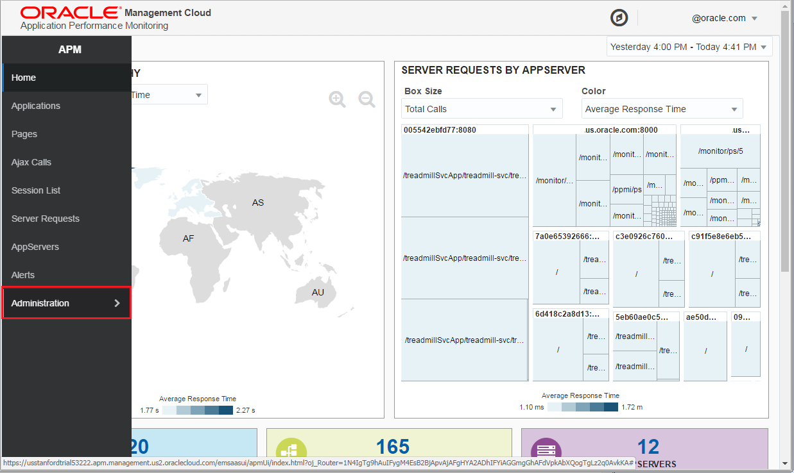

Click the **Application definitions** menu item.


Here you can define new application definition. This definition ensures that your application(s) will have a single pane view. Click **Create Application Definition**.


On the Application Specification dialog define the criteria which is unique to your application or environment. We will use the customized *URI Prefix* that we chose earlier as the identifier for our application. The Application Name can be anything but it is useful to use similar name to context path. Please note the Application Name can not contain '-'. Select **Pages** for criteria and choose **URL**. The pattern for URL should be *URI Prefix* from your notes. Check your application URL in the browser to find the right context path/criteria. Click **OK** for the criteria and then **Save** the Application Definition.
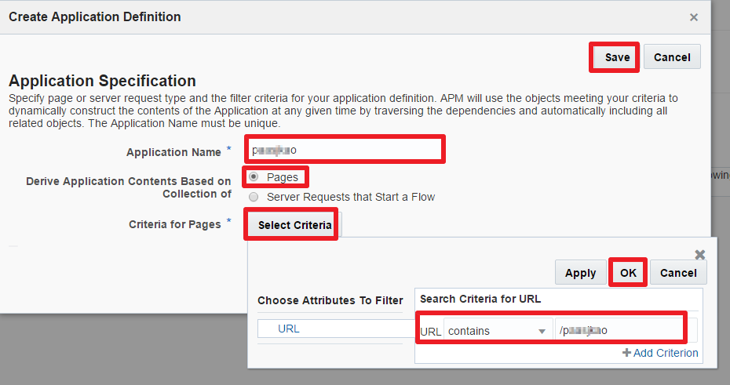

Now go back to the Applications page using the left side menu. Click the hamburger icon and select the **Back** arrow then the **Applications** menu item.


Now you should see your newly defined Applications. Create some load (Ctrl+Refresh the applications page) on your applications to get some statistics.


#### Generate Load ####
To generate a reasonable amount of data, do the following about 4-5 times per minute over a period of 5-10 minutes:
+ Click on the different buttons on the page.
+ Click the **Compute* button a few extra times
+ Try entering `1048576` into **Return Array Index** and see what comes back when you press **Compute**.
+ Reload the page and do the above sequence a few more times

#### Use APM to Understand Application Behavior ####
Navigate back into your application in APM, and set the time frame to the last 15 minutes:
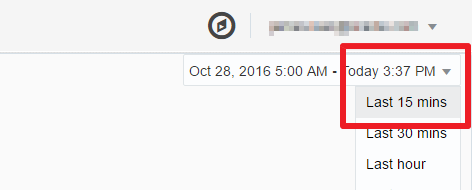

Try use the product and navigate the APM UI answer the following questions:

Can you figure out how much memory is allocated for each execution of the sum of random integers? Does this amount seem correct?
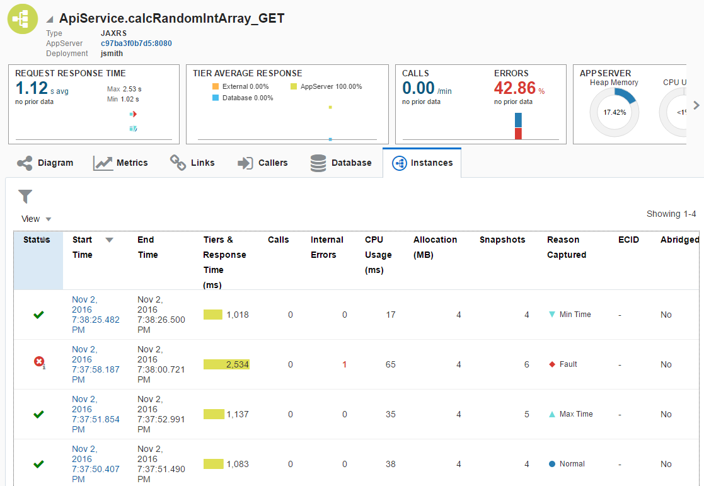

Can you tell whether the quote functionality uses static data or makes a real external web service call?
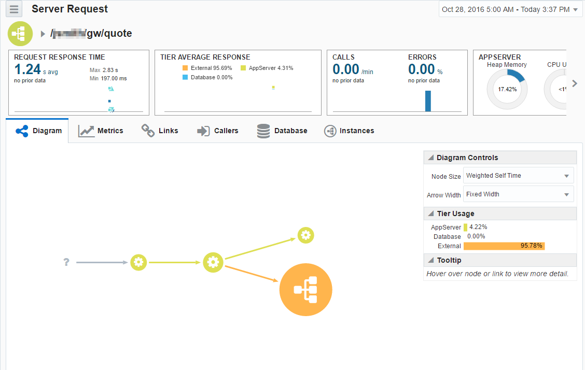

Can you tell which button clicks result in AJAX calls and which do not? Can you determine the cause of the behavior when you click **Compute* with 1048576 in *Return Array Index*?
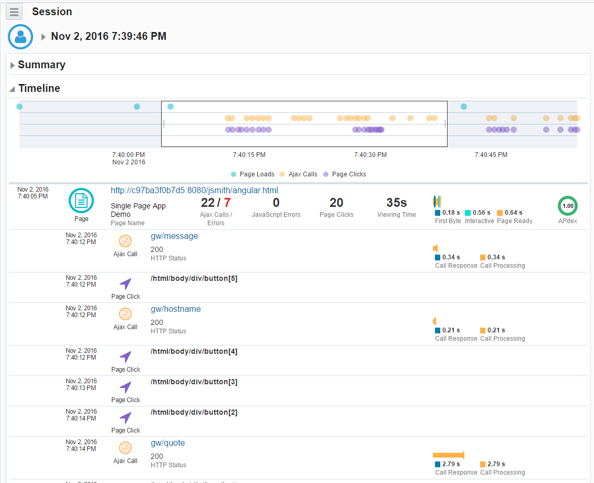

This concludes the required parts of this tutorial.

**Scroll down to check your answers!**

#### (Optional) Installing and Provisioning APM Java Agent on Apache Tomcat (or other Java EE application servers) Manually ####

	[oracle@localhost u01]$ unzip AgentInstall.zip -d /u01/apm_temp
	Archive:  AgentInstall.zip
	  inflating: /u01/apm_temp/AgentInstall.sh  
	  inflating: /u01/apm_temp/AgentInstall.bat  
	  inflating: /u01/apm_temp/README         
	[oracle@localhost u01]$

From the local directory where you have extracted the contents of the master installer ZIP file, change the permissions of `AgentInstall.sh`:

	[oracle@localhost u01]$ cd /u01/apm_temp/
	[oracle@localhost apm_temp]$ chmod 755 AgentInstall.sh

Now run the following command to download the software:

	[oracle@localhost apm_temp]$ ./AgentInstall.sh AGENT_TYPE=apm_java_as_agent STAGE_LOCATION=${STAGE_DIR} AGENT_REGISTRATION_KEY=${REG_KEY}
	Downloading apm agent software ...
	[oracle@localhost apm_temp]$


After you have downloaded and extracted the installer, install and provision the APM Java Agent in your application server domain running the `./ProvisionApmJavaAsAgent.sh -d ${DESTINATION}` command in the staging directory. Just for sure change the permissions for `ProvisionApmJavaAsAgent.sh`.

	[oracle@localhost apm_temp]$ cd ${STAGE_DIR}
	[oracle@localhost apm_staging]$ chmod +x ProvisionApmJavaAsAgent.sh
	[oracle@localhost apm_staging]$ ./ProvisionApmJavaAsAgent.sh -d ${DESTINATION}
	 The current destination for provisioning the APM Java AS Agent is TOMCAT. This needs to be done with no-wallet option. Hence the installation will be done with no wallet.
	*************************************************************************
	Your settings are as follows:

	              Tenant_ID = usxxxxxxtrial
	            Destination = /u01/apache-tomcat-8.5.6
	        RegistrationKey = EQAAAA9idWlsdEluQUxDS2V5LjG5fm5XfcX985Q06kU2dZKhzVW8WocMgJIb63bDKqdZ072pnsoScmcpIjRxxxxxxxxxxxxxxxxxxx==

	Do you wish to proceed with these values? y
	Archive:  /u01/apm_staging/ApmAgent-1.10.zip
	   creating: apmagent/
	   creating: apmagent/config/
	  inflating: apmagent/config/AgentHttpBasic.properties  
	  inflating: apmagent/config/MetricCollector.json  
	  inflating: apmagent/config/BrowserAgent.json  
	  inflating: apmagent/config/AgentStartup.properties  
	  inflating: apmagent/config/Servlet.json  
	   creating: apmagent/lib/
	   creating: apmagent/lib/system/
	  inflating: apmagent/lib/system/instrumentor-2.2.0.1.jar  
	  inflating: apmagent/lib/system/ApmAgentInstrumentation.jar  
	  inflating: apmagent/lib/system/ApmProbeSystem.jar  
	   creating: apmagent/lib/action/
	  inflating: apmagent/lib/action/ApmProbeAction.jar  
	   creating: apmagent/lib/agent/
	  inflating: apmagent/lib/agent/jackson-core-asl-1.9.13.jar  
	  inflating: apmagent/lib/agent/jackson-jaxrs-1.9.13.jar  
	  inflating: apmagent/lib/agent/commons-logging-1.1.1.jar  
	  inflating: apmagent/lib/agent/httpcore-4.2.4.jar  
	  inflating: apmagent/lib/agent/ApmAgentUtility.jar  
	  inflating: apmagent/lib/agent/ApmAgentRuntime.jar  
	  inflating: apmagent/lib/agent/commons-codec-1.8.jar  
	  inflating: apmagent/lib/agent/jackson-mapper-asl-1.9.13.jar  
	  inflating: apmagent/lib/agent/jettison-1.3.4.jar  
	  inflating: apmagent/lib/agent/ApmEumFilter.jar  
	  inflating: apmagent/lib/agent/cmnutil.jar  
	  inflating: apmagent/lib/agent/httpclient-4.2.5.jar  
	  inflating: apmagent/lib/agent/agentToEngine.jar  
	  inflating: apmagent/lib/agent/jackson-xc-1.9.13.jar  
	  inflating: apmagent/lib/agent/ApmProbeRuntime.jar  
	*******************************************************************************
	So far, so good! Now, one more thing to do, which you will perform manually.
	You will need to modify your destination's start up script so that
	the APM instrumentation you have just laid down and configured will be invoked.

	Here's what you do:


	Weblogic :
	---------

	1. Make a backup copy of your startWebLogic.sh file:
	        % cd $DOMAIN_HOME/bin
	        % cp startWebLogic.sh startWebLogic.sh.orig

	2. Now edit the script with your favorite text editor (e.g. "vi"), and add the
	   -javaagent option to the set of JAVA_OPTIONS found therein, by adding the
	   following line right after the "setDomainEnv.sh" call:

	        JAVA_OPTIONS="${JAVA_OPTIONS} -javaagent:${DOMAIN_HOME}/apmagent/lib/system/ApmAgentInstrumentation.jar"

	3. Stop and restart your WebLogic Application Server. Note that you will use
	   the $DOMAIN_HOME/bin version of stopWebLogic.sh, but the $DOMAIN_HOME
	   version of startWebLogic.sh, even though you edited the $DOMAIN_HOME/bin
	   version. The "upper" level one will, in fact, invoke the "lower" level one:

	        % cd $DOMAIN_HOME/bin
	        % ./stopWebLogic.sh                        
	        % cd ..                                    
	        % nohup ./startWebLogic.sh >& startup.log &

	4. Finally, if you have any Managed WebLogic Application Servers, stop and
	   restart them also:

	        % cd $DOMAIN_HOME/bin
	        % ./stopManagedWebLogic.sh {SERVER_NAME} {ADMIN_URL} {USER_NAME} {PASSWORD}                                                  
	        % nohup ./startManagedWebLogic.sh {SERVER_NAME} {ADMIN_URL} >& {SERVER_NAME}.log &

	Tomcat :
	-------

	1. Make a backup copy of your Catalina.sh file:
	            % cd "$CATALINA_HOME/bin"
	            % cp catalina.sh catalina.sh.orig

	2. Now edit the script with your favorite text editor (e.g. "vi") , and add the
	   -javaagent option to the set of CATALINA_OPTS, by adding the
	   following line:

	    	 CATALINA_OPTS="${CATALINA_OPTS} -javaagent:\"${CATALINA_HOME}/apmagent/lib/system/ApmAgentInstrumentation.jar\""

	3. Stop and restart your Tomcat Server.

	        % cd "$CATALINA_HOME/bin"
	        % ./shutdown.sh
	        % ./startup.sh

	JBoss 7.x/Wildfly(Standlone Mode):
	----------

	1. Make a backup copy of your standalone.conf file:
	        % cd $JBOSS_HOME/bin
		% cp standalone.conf standalone.conf.orig

	2. Now edit standalone.conf with your favorite text editor (e.g. "vi"), and search text 'JBOSS_MODULES_SYSTEM_PKGS'
		Add  oracle.apmaas,org.jboss.logmanager to it.

	 	If it was JBOSS_MODULES_SYSTEM_PKGS="org.jboss.byteman" then the new value will be JBOSS_MODULES_SYSTEM_PKGS="org.jboss.byteman,oracle.apmaas,org.jboss.logmanager"

	3. Go to the end of the file and add following statements

		JAVA_OPTS="$JAVA_OPTS -Djava.util.logging.manager=org.jboss.logmanager.LogManager"

		# Location and version of below jar files would be different for jboss versions. You can modify java opts with correct version of jar file. If files are not present then you can download the jars and modify paths of jar in below statements.

		JAVA_OPTS="$JAVA_OPTS -Xbootclasspath/p:<JBOSS_HOME>/modules/org/jboss/logmanager/main/jboss-logmanager-1.2.2.GA.jar:<JBOSS_HOME>/modules/org/jboss/logmanager/log4j/main/jboss-logmanager-log4j-1.0.0.GA.jar:<JBOSS_HOME>/modules/org/apache/log4j/main/log4j-1.2.16.jar"

		JAVA_OPTS="$JAVA_OPTS -javaagent:<JBOSS_HOME>/apmagent/lib/system/ApmAgentInstrumentation.jar"

	4. Stop and restart your JBoss/Wildfly Server


	JBoss 7.x/Wildfly(Domain Mode):
	-----------------------

	1. Make a backup copy of your domain.conf file:
	        % cd $JBOSS_HOME/bin
		% cp domain.conf domain.conf.orig

	2. Now edit domain.conf with your favorite text editor (e.g. "vi"), and search text 'JBOSS_MODULES_SYSTEM_PKGS'

		Add  oracle.apmaas,org.jboss.logmanager to it.

		If it was JBOSS_MODULES_SYSTEM_PKGS="org.jboss.byteman" then the new value will be JBOSS_MODULES_SYSTEM_PKGS="org.jboss.byteman,oracle.apmaas,org.jboss.logmanager"

	3. Go to the end of the file and add following statements

		JAVA_OPTS="$JAVA_OPTS -Djava.util.logging.manager=org.jboss.logmanager.LogManager"

		# Location and version of below jar files would be different for jboss versions. You can modify java opts with correct version of jar file. If files are not present then you can download the jars and modify paths of jar in below statements.

		JAVA_OPTS="$JAVA_OPTS -Xbootclasspath/p:<JBOSS_HOME>/modules/org/jboss/logmanager/main/jboss-logmanager-1.2.2.GA.jar:<JBOSS_HOME>/modules/org/jboss/logmanager/log4j/main/jboss-logmanager-log4j-1.0.0.GA.jar:<JBOSS_HOME>/modules/org/apache/log4j/main/log4j-1.2.16.jar"

		JAVA_OPTS="$JAVA_OPTS -javaagent:<JBOSS_HOME>/apmagent/lib/system/ApmAgentInstrumentation.jar"

	4. Stop and restart your JBoss/Wildfly Server


	Websphere :
	-----------------------

	1. From websphere admin console, click on Servers tab and  select the server on which you want to provision the APM Agent. Expand Java and Process Management tab and select Process Definition. Select Java Virtual Machine under Additional Properties tab.

	2. In Generic JVM arguments field, add the following line:
		-javaagent:$WAS_HOME/apmagent/lib/system/ApmAgentInstrumentation.jar -Dws.ext.dirs=$WAS_HOME/apmagent/lib/agent/ApmEumFilter.jar

	3. Create a backup of $WAS_HOME/properties/server.policy file
	    	% cd $WAS_HOME/properties
		% cp server.policy server.policy.orig

	4. Add the following snippet in $WAS_HOME/properties/server.policy to grant permission to apmagent directory.

	        grant codeBase "file:$WAS_HOME/apmagent/-"
	        {
	        permission java.security.AllPermission;
	        };

	5. Restart the websphere server

	*******************************************************************************
	[oracle@localhost apm_staging]$

Now the local installation of Apache Tomcat is almost ready to run and includes APM agent. As you can see from the output you have to add `-javaagent:"${CATALINA_HOME}/apmagent/lib/system/ApmAgentInstrumentation.jar` to `CATALINA_OPTS` and restart the server.

#### Answers

1. *Can you figure out how much memory is allocated for each execution of the sum of random integers? Does this amount seem correct?*
To figure out memory allocated for the sum of random integers, first identify the server request associated with the API, then take a look at an instance sample. Each instance carries the amount of memory allocated during the request. The amount should be correct, in that it should be around 4 megabytes, which would correspond to 1M integers in the array times 4 bytes each (32-bit ints in Java).

2. *Can you tell whether the quote functionality uses static data or makes a real external web service call?* To figure out whether the quote functionality uses static data or makes a real external web service call, identify the server request associated with this API, then look at its diagram. Outbound web service calls are there and you can see (1) that the service does make a web service call and (2) the URL that the web service call is made to, which is a real 3rd party service.

3. *Can you tell which button clicks result in AJAX calls and which do not? Can you determine the cause of the behavior when you click Compute with 1048576 in Return Array Index?* To see which button clicks result in AJAX calls and which do not, take a look at the Session List for one of your sessions and take a look at the ordering of clicks and ajax calls. Based on the path, you can identify which buttons were clicked and which clicks were followed by AJAX calls and which were not.
