# ORACLE Cloud-Native DevOps workshop #
-----
## Migrate Weblogic 10.3.6 (on premise) Application to Java Cloud Service ##

### About this tutorial ###
In this use case you have a JEE5 application running on top of a Weblogic 10.3.6 installation and you want to migrate to Oracle Public Cloud Service using Java Cloud Service's AppToCloud feature. Oracle’s AppToCloud infrastructure allows you to export an existing domain configuration and Java applications, and to then provision a new Oracle Java Cloud Service instance with the same domain resources and applications. See the diagram which shows the on premise and the migrated architecture. The migration is completely done by Oracle's AppToCloud feature and requires minimal intervetion to achive the migration to the cloud.

This tutorial demonstrates how to:
  
+ export on premise Weblogic 10.3.6 domain including application bits using App2Cloud tool,
+ create Java Cloud Service instance using Oracle Java Cloud Service's AppToCloud function
+ import application running and exported as part of the on premise Weblogic 10.3.6 production domain.

### Prerequisites ###

- Running and "empty" [Database Cloud Service](../preparation.md) instance which has no Java Cloud Services dependency.
- Download SSH keypair (`pk.openssh`, `public.key`) into your `/u01/content/cloud-native-devops-workshop/cloud-utils` directory from image [location](https://drive.google.com/open?id=0B0MXC4qaECO6RHBWMEttdW9fOVk). Than change the permissions of the private key:

		[oracle@localhost cloud-utils]$ chmod 400 /u01/content/cloud-native-devops-workshop/cloud-utils/pk.openssh		

### Steps ###

#### Create Weblogic 10.3.6 domain and deploy the Petstore sample application ####
Open a terminal and change to `GIT_REPO_LOCAL_CLONE/app-2-cloud` folder.

	$ [oracle@localhost Desktop]$ cd /u01/content/cloud-native-devops-workshop/app-2-cloud
	
Run the `prepareEnv.sh` script which starts the database, creates Weblogic 10.3.6 domain, starts Weblogic servers and deploys the Petstore demo application. The script usage is: `prepareEnv.sh <db user> <db password> [<PDB name>]`. In the provided virtualbox environment run the script with the following parameters:

    $ [oracle@localhost app-2-cloud]$ ./prepareEnv.sh system welcome1
	  Oracle database (sid: orcl) is running.
	  Open pluggable database: PDBORCL.
    PDBORCL is already opened
	  ********** CREATING PetStore DB USER **********************************************
	  
	  User dropped.
	  
	  
	  User created.
	  
	  
	  Grant succeeded.
	  
	  ********** CREATING DB ENTRIES FOR PetStore Application ***************************
	  
	  SQL*Plus: Release 12.1.0.2.0 Production on Tue Oct 11 05:55:45 2016
	  
	  Copyright (c) 1982, 2014, Oracle.  All rights reserved.
	  
	  
	  Connected to:
	  Oracle Database 12c Enterprise Edition Release 12.1.0.2.0 - 64bit Production
	  With the Partitioning, OLAP, Advanced Analytics and Real Application Testing options
	  
	  SQL> 
	  Table created.
	  
	  
	  Table created.
	  
	  
	  Table created.
	  
	  
	  Table created.
	  
	  
	  Table created.
	  
	  
	  Table created.
	  
	  
	  Table created.
	  
	  
	  Table created.
	  
	  
	  Table created.
	  
	  
	  1 row created.
	  
	  ...
	  
	  1 row created.
	  
	  
	  Commit complete.
	  
	  SQL> Disconnected from Oracle Database 12c Enterprise Edition Release 12.1.0.2.0 - 64bit Production
	  With the Partitioning, OLAP, Advanced Analytics and Real Application Testing options
	  ********** CREATING PETSTORE_DOMAIN (WEBLOGIC 10.3.6 - PETSTORE_DOMAIN) ***********
	  << read template from "/u01/content/cloud-native-devops-workshop/app-2-cloud/template/petstore_domain_template.jar"
	  >>  succeed: read template from "/u01/content/cloud-native-devops-workshop/app-2-cloud/template/petstore_domain_template.jar"
	  << find User "weblogic" as u1_CREATE_IF_NOT_EXIST
	  >>  succeed: find User "weblogic" as u1_CREATE_IF_NOT_EXIST
	  << set u1_CREATE_IF_NOT_EXIST attribute Password to "********"
	  >>  succeed: set u1_CREATE_IF_NOT_EXIST attribute Password to "********"
	  << write Domain to "/u01/wins/wls1036/user_projects/domains/petstore_domain"
	  ...............................................................................................
	  >>  succeed: write Domain to "/u01/wins/wls1036/user_projects/domains/petstore_domain"
	  << close template
	  >>  succeed: close template
	  ********** STARTING ADMIN SERVER (WEBLOGIC 10.3.6 - PETSTORE_DOMAIN) **************
	  ********** STARTING MSERVER1 SERVER (WEBLOGIC 10.3.6 - PETSTORE_DOMAIN) ***********
	  ********** STARTING MSERVER2 SERVER (WEBLOGIC 10.3.6 - PETSTORE_DOMAIN) ***********
	  ********** ADMIN SERVER (WEBLOGIC 10.3.6 - DOMAIN1036) HAS BEEN STARTED ***********
	  ********** DEPLOY PETSTORE (WEBLOGIC 10.3.6 - PETSTORE_DOMAIN) ********************
	  
	  Initializing WebLogic Scripting Tool (WLST) ...
	  
	  Welcome to WebLogic Server Administration Scripting Shell
	  
	  Type help() for help on available commands
	  
	  ************************ Create resources for PETSTORE application *****************************************
	  Connecting to t3://localhost:7001 with userid weblogic ...
	  Successfully connected to Admin Server 'AdminServer' that belongs to domain 'petstore_domain'.
	  
	  Warning: An insecure protocol was used to connect to the 
	  server. To ensure on-the-wire security, the SSL port or 
	  Admin port should be used instead.
	  
	  Location changed to edit tree. This is a writable tree with 
	  DomainMBean as the root. To make changes you will need to start 
	  an edit session via startEdit(). 
	  
	  For more help, use help(edit)
	  
	  Starting an edit session ...
	  Started edit session, please be sure to save and activate your 
	  changes once you are done.
	  Saving all your changes ...
	  Saved all your changes successfully.
	  Activating all your changes, this may take a while ... 
	  The edit lock associated with this edit session is released 
	  once the activation is completed.
	  Activation completed
	  ************************ Deploy PETSTORE application *****************************************
	  Deploying application from /u01/wins/wls1036/wlserver_10.3/common/deployable-libraries/jsf-2.0.war to targets petstore_cluster (upload=false) ...
	  <Oct 11, 2016 5:57:20 AM PDT> <Info> <J2EE Deployment SPI> <BEA-260121> <Initiating deploy operation for application, jsf [archive: /u01/wins/wls1036/wlserver_10.3/common/deployable-libraries/jsf-2.0.war], to petstore_cluster .> 
	  .Completed the deployment of Application with status completed
	  Current Status of your Deployment:
	  Deployment command type: deploy
	  Deployment State       : completed
	  Deployment Message     : [Deployer:149194]Operation 'deploy' on application 'jsf [LibSpecVersion=2.0,LibImplVersion=1.0.0.0_2-0-2]' has succeeded on 'mserver2'
	  Deploying application from /u01/content/cloud-native-devops-workshop/app-2-cloud/petstore.12.war to targets petstore_cluster (upload=false) ...
    <Oct 11, 2016 5:57:23 AM PDT> <Info> <J2EE Deployment SPI> <BEA-260121> <Initiating deploy operation for application, Petstore [archive: /u01/content/cloud-native-devops-workshop/app-2-cloud/petstore.12.war], to petstore_cluster .> 
	  ...Completed the deployment of Application with status completed
	  Current Status of your Deployment:
	  Deployment command type: deploy
	  Deployment State       : completed
	  Deployment Message     : [Deployer:149194]Operation 'deploy' on application 'Petstore' has succeeded on 'mserver2'
	  Starting application Petstore.
	  <Oct 11, 2016 5:57:33 AM PDT> <Info> <J2EE Deployment SPI> <BEA-260121> <Initiating start operation for application, Petstore [archive: null], to petstore_cluster .> 
	  .Completed the start of Application with status completed
	  Current Status of your Deployment:
	  Deployment command type: start
	  Deployment State       : completed
	  Deployment Message     : [Deployer:149194]Operation 'start' on application 'Petstore' has succeeded on 'mserver2'
	  No stack trace available.
	  <Oct 11, 2016 5:57:36 AM PDT> <Warning> <JNDI> <BEA-050001> <WLContext.close() was called in a different thread than the one in which it was created.> 
	  ********** OPEN PETSTORE APPLICATION AT http://localhost:7003/petstore/faces/catalog.jsp
	  [oracle@localhost app-2-cloud]$ 

Now check the Petstore demo application. Open a browser and enter *http://localhost:7003/petstore/faces/catalog.jsp* URL to hit the application.

Note in the virtualbox environment there is no load balancer configured for the cluster which contains 2 managed servers. The 7003 and 7004 port is the direct access to the managed servers. 

#### Export the domain using AppToCloud tool ####

If you are not using the prepared virtualbox environment you need to download the AppToCloud tool from this [location](http://www.oracle.com/technetwork/topics/cloud/downloads/index.html#apptocloud). You can also use the Download Center in the service console. Click your user name at the top of the console, select Help and then select Download Center. The tool is simply zipped so use an archive tool to extract `a2c-zip-installer.zip` to your destination directory. AppToCloud needs to be installed on the machine that is running Administration Server for your domain. In case of prepared virtualbox environment the tool is extracted to `/u01/oracle_jcs_app2cloud` folder. Verify that the file `a2c-healthcheck.sh` exists in the specified directory.

	[oracle@localhost app-2-cloud]$ ls -la /u01/oracle_jcs_app2cloud/bin
	total 60
	drwxr-xr-x. 2 oracle oracle 4096 Oct 10 09:01 .
	drwxr-x---. 7 oracle oracle 4096 Oct 11 00:16 ..
	-rw-r-----. 1 oracle oracle 7582 Aug  4 11:25 a2c-export.cmd
	-rwxr-x---. 1 oracle oracle 7137 Aug  4 11:25 a2c-export.sh
	-rw-r-----. 1 oracle oracle 8683 Aug  4 11:25 a2c-healthcheck.cmd
	-rwxr-x---. 1 oracle oracle 8169 Aug  4 11:25 a2c-healthcheck.sh
	-rw-r-----. 1 oracle oracle 6095 Aug  4 11:25 a2c-import.cmd
	-rwxr-x---. 1 oracle oracle 5673 Aug  4 11:25 a2c-import.sh

Now use the `a2c-healthcheck` command in the AppToCloud tools to validate your on-premises WebLogic Server domain and applications in preparation to move them to an Oracle Java Cloud Service environment. The command requires the following parameters:

1.  Top level directory of your WebLogic Server installation on the machine. This location is also referred to as `ORACLE_HOME`.
2.  The administration URL of the Administration Server.
3.  The user credentials for the domain’s system administrator.

Now run the `a2c-healthcheck.sh` to check and export the running domain. Copy the following command and arguments into your terminal:

	/u01/oracle_jcs_app2cloud/bin/a2c-healthcheck.sh -oh /u01/wins/wls1036 -adminUrl t3://localhost:7001 -adminUser weblogic -outputDir /u01/jcs_a2c_output

During the execution enter the administrator’s password: *welcome1*, when prompted for it.

	[oracle@localhost app-2-cloud]$ /u01/oracle_jcs_app2cloud/bin/a2c-healthcheck.sh -oh /u01/wins/wls1036 -adminUrl t3://localhost:7001 -adminUser weblogic -outputDir /u01/jcs_a2c_output
	JDK version is 1.8.0_60-b27
	A2C_HOME is /u01/oracle_jcs_app2cloud
	/usr/java/latest/bin/java -Xmx512m -cp /u01/oracle_jcs_app2cloud/jcs_a2c/modules/features/jcsa2c_lib.jar -Djava.util.logging.config.class=oracle.jcs.lifecycle.util.JCSLifecycleLoggingConfig oracle.jcs.lifecycle.healthcheck.AppToCloudHealthCheck -oh /u01/wins/wls1036 -adminUrl t3://localhost:7001 -adminUser weblogic -outputDir /u01/jcs_a2c_output
	The a2c-healthcheck program will write its log to /u01/oracle_jcs_app2cloud/logs/jcsa2c-healthcheck.log
	Enter password: 
	Checking Domain Health
	Connecting to domain
	
	Connected to the domain petstore_domain
	
	Checking Java Configuration
	...
	checking server runtime : mserver2
	...
	checking server runtime : mserver1
	...
	checking server runtime : AdminServer
	Done Checking Java Configuration
	Checking Servers Health
	
	Done checking Servers Health
	Checking Applications Health
	Checking jsf#2.0@1.0.0.0_2-0-2
	Checking Petstore
	Done Checking Applications Health
	Checking Datasource Health
	Done Checking Datasource Health
	Done Checking Domain Health
	
	Activity Log for HEALTHCHECK
	
	Informational Messages:
	
	1. JCSLCM-04037: Healthcheck Completed
	
	An HTML version of this report can be found at /u01/jcs_a2c_output/reports/petstore_domain-healthcheck-activityreport.html
	
	Output archive saved as /u01/jcs_a2c_output/petstore_domain.zip.  You can use this archive for the a2c-export tool.
	
	
	a2c-healthcheck completed successfully (exit code = 0)
	[oracle@localhost bin]$ 

Verify that the Health Check tool completed successfully (exit code is 0). Address any problems described in the Error Messages section of the Health Check output. Then run the Health Check tool again.
You can also view the activity report as an HTML file. The report’s file name and location are included in the Health Check output.

#### Migrate your on-premises Oracle Database to Oracle Database Cloud Service ####

An Oracle Java Cloud Service instance requires an existing Oracle Database Cloud Service deployment to host the Oracle JRF schemas. These schemas are provisioned automatically when you create a new service instance.

Your Java applications likely use additional on-premises databases. Oracle recommends that you migrate these application databases to Oracle Database Cloud Service as well. When you create an Oracle Java Cloud Service service instance with AppToCloud you can associate each of your existing Oracle WebLogic Server data sources with an application database running in Oracle Database Cloud Service.

In this tutorial we will use the same Database Cloud Service to host Oracle JRF schemas and Petstore demo application's schema.

There are many ways to migrate on-premises database to Database Cloud Service. In this use case we are using SQL scripts to create the necessary schema, tables and data for the demo application. For this purpose you need to execute a single script which needs the followinfg parameters:

- **Database** Cloud Service's **administrator username**. Typically it is *system* if you have not changed.
- **Database** Cloud Service's **administrator password**. Password you provided during Database Cloud Service instance creation. If you used the cloud tool and have not changed the default value in `environment.properties` then it is *Welcome_1*.
- **SSH private key file**. Private key belongs to the Database Cloud Service. If you have followed the [preparation guide](preparation.md) guide the file name must be *pk.openssh* and the location is the `/u01/content/cloud-native-devops-workshop/cloud-utils` folder. If you have different name and location then provide that path and file name.
- **Database** Cloud Service's public **IP address**. The public IP address of the instance to access to the service's VM. See next step to determine.
- **Pluggable database name** is optional. In case Oracle Database Cloud Service the **default** is *PDB1* which will be used. If your instance has different name please specify.

To get the public IP address using the console [Sign in](../common/sign.in.to.oracle.cloud.md) to [https://cloud.oracle.com/sign-in](https://cloud.oracle.com/sign-in). On the dashboard open the Database Cloud Service Console.

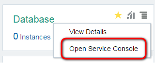
Click on your Database Cloud Service which will be associated with Java Cloud Service and host Petstore demo application's schema.

Note the public IP address of the node hosting Database Cloud Service.

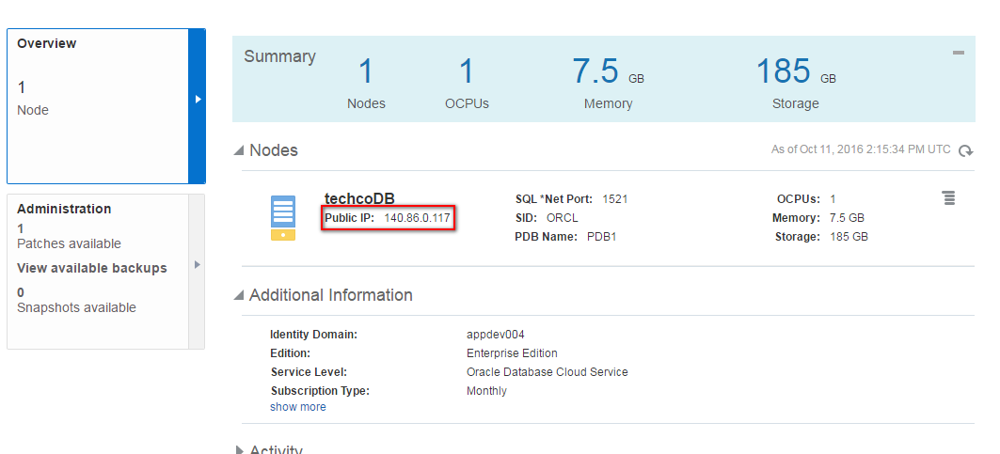

Having all the necessary input run the script which will prepare the Database Cloud Service for Petstore demo application. If you have the default values just replace the correct IP address:

	./prepareDBCS.sh system Welcome_1 ../cloud-utils/pk.openssh <YOUR_DBCS_PUBLIC_IP>

The output should be similar to the following:

	[oracle@localhost app-2-cloud]$ ./prepareDBCS.sh system <YOUR_DBCS_SYSTEM_PASSWORD ><YOUR_PRIVATEKEY_LOCATION> <YOUR_DBCS_PUBLIC_IP>
	Enter passphrase for key '../pk.openssh': 
	create_user.sh                                                                                                     100%  301     0.3KB/s   00:00    
	create_user.sql                                                                                                    100%  101     0.1KB/s   00:00    
	petstore.sql                                                                                                       100%   55KB  55.3KB/s   00:00    
	Enter passphrase for key '../pk.openssh': 
	
	SQL*Plus: Release 12.1.0.2.0 Production on Tue Oct 11 09:32:46 2016
	
	Copyright (c) 1982, 2014, Oracle.  All rights reserved.
	
	Last Successful login time: Mon Sep 12 2016 12:40:26 +00:00
	
	Connected to:
	Oracle Database 12c Enterprise Edition Release 12.1.0.2.0 - 64bit Production
	
	SQL> DROP USER petstore cascade
	        *
	ERROR at line 1:
	ORA-01918: user 'PETSTORE' does not exist
	
	
	SQL> SQL> 
	User created.
	
	SQL> 
	Grant succeeded.
	
	SQL> Disconnected from Oracle Database 12c Enterprise Edition Release 12.1.0.2.0 - 64bit Production
	
	SQL*Plus: Release 12.1.0.2.0 Production on Tue Oct 11 09:32:46 2016
	
	Copyright (c) 1982, 2014, Oracle.  All rights reserved.
	
	
	Connected to:
	Oracle Database 12c Enterprise Edition Release 12.1.0.2.0 - 64bit Production
	
	SQL> SQL>   2    3    4    5    6    7  
	Table created.
	
	...
	
	SQL> 
	1 row created.
	
	SQL> SQL> 
	Commit complete.
	
	SQL> Disconnected from Oracle Database 12c Enterprise Edition Release 12.1.0.2.0 - 64bit Production
	[oracle@localhost app-2-cloud]$ 

The script is re-runnable. In case of failure try to fix the parameter or other issue and run again.

Now the given Database Cloud Service has a `PETSTORE` schema which contains the necessary tables and data. The password for `PETSTORE` has been set to the provided Database Cloud Service's administrator password.

#### Exporting an On-Premises WebLogic Domain ####

The Export tool captures a domain’s configuration and Java applications. It updates the archive file that was previously generated by the Health Check tool, generates a JSON file, and uploads these AppToCloud artifacts to an existing storage container in the Oracle Storage Cloud Service.

For simplification we can recommend to use the storage container what was provided for Database Cloud Service. If you don't remember check the path on the Database Cloud Service detail page.

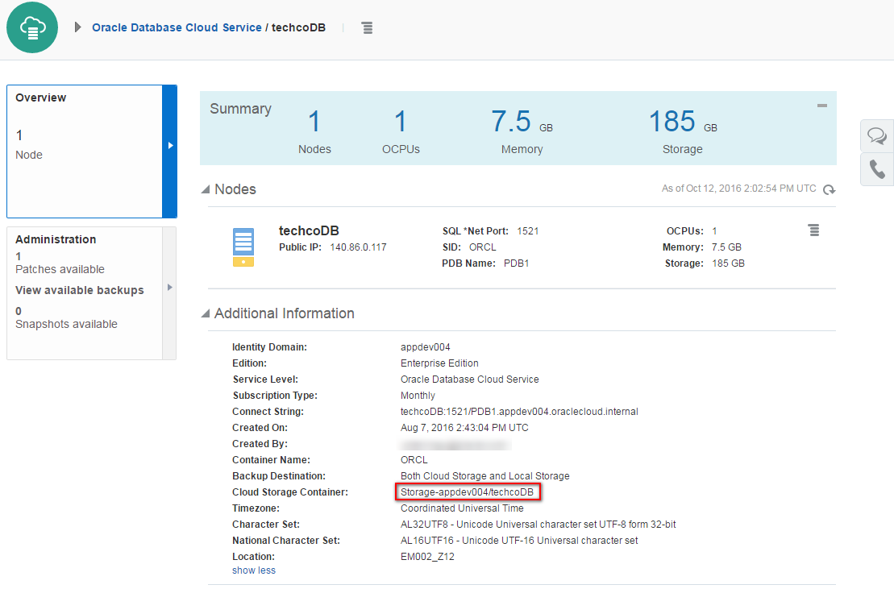
If you follow the recommendations and want to create new container see [Creating Containers](http://www.oracle.com/pls/topic/lookup?ctx=cloud&id=CSSTO00708) in Using Oracle Storage Cloud Service.

Now use the `a2c-export.sh` script in the AppToCloud tools to capture your on-premises WebLogic Server domain and applications and to move them to a storage container that’s accessible to your Oracle Java Cloud Service environment. The command requires the following parameters:

1.  Top level directory of the WebLogic Server domain.
2.  Top level directory of your WebLogic Server installation.
2.  Folder to save archive and JSON config file.
3.  Cloud storage container. Format of the path: `Storage-<IDENTITY_DOMAIN>/MyContainer`. If you have not changed the container name in the `environment.properties` then it has to be `app2cloud`.
4.  Cloud storage user credential.

Using the parameters above run the `a2c-export.sh` to complete the export and upload. The following parameters belong to prepared virtualbox environment except the Cloud storage conatiner and credentials. Please change according to your environment. When prompted, enter the password for your cloud storage user.

	[oracle@localhost app-2-cloud]$ /u01/oracle_jcs_app2cloud/bin/a2c-export.sh -oh /u01/wins/wls1036 -domainDir /u01/wins/wls1036/user_projects/domains/petstore_domain -archiveFile /u01/jcs_a2c_output/petstore_domain.zip -cloudStorageContainer Storage-<IDENTITY_DOMAIN>/app2cloud -cloudStorageUser <YOUR_CLOUD_STORAGE_USER>
	JDK version is 1.8.0_60-b27
	A2C_HOME is /u01/oracle_jcs_app2cloud
	/usr/java/latest/bin/java -Xmx512m -DUseSunHttpHandler=true -cp /u01/oracle_jcs_app2cloud/jcs_a2c/modules/features/jcsa2c_lib.jar -Djava.util.logging.config.class=oracle.jcs.lifecycle.util.JCSLifecycleLoggingConfig oracle.jcs.lifecycle.discovery.AppToCloudExport -oh /u01/wins/wls1036 -domainDir /u01/wins/wls1036/user_projects/domains/petstore_domain -archiveFile /u01/jcs_a2c_output/petstore_domain.zip -cloudStorageContainer Storage-appdev004/app2cloud -cloudStorageUser peter.nagy@oracle.com
	The a2c-export program will write its log to /u01/oracle_jcs_app2cloud/logs/jcsa2c-export.log
	Enter Storage Cloud password: 
	####<Oct 11, 2016 12:30:52 AM> <INFO> <AppToCloudExport> <getModel> <JCSLCM-02005> <Creating new model for domain /u01/wins/wls1036/user_projects/domains/petstore_domain>
	####<Oct 11, 2016 12:30:53 AM> <INFO> <EnvironmentModelBuilder> <populateOrRefreshFromEnvironment> <FMWPLATFRM-08552> <Try to discover a WebLogic Domain in offline mode>
	####<Oct 11, 2016 12:31:03 AM> <INFO> <EnvironmentModelBuilder> <populateOrRefreshFromEnvironment> <FMWPLATFRM-08550> <End of the Environment discovery>
	####<Oct 11, 2016 12:31:03 AM> <WARNING> <ModelNotYetImplementedFeaturesScrubber> <transform> <JCSLCM-00579> <Export for Security configuration is not currently implemented and must be manually configured on the target domain.>
  	####<Oct 11, 2016 12:31:03 AM> <INFO> <AppToCloudExport> <archiveApplications> <JCSLCM-02003> <Adding application to the archive: Petstore from /u01/content/cloud-native-devops-workshop/app-2-cloud/petstore.12.war>
	####<Oct 11, 2016 12:31:04 AM> <INFO> <AppToCloudExport> <archiveSharedLibraries> <JCSLCM-02003> <Adding library to the archive: jsf#2.0@1.0.0.0_2-0-2 from /u01/wins/wls1036/wlserver_10.3/common/deployable-libraries/jsf-2.0.war>
	####<Oct 11, 2016 12:31:05 AM> <INFO> <AppToCloudExport> <run> <JCSLCM-02009> <Successfully exported model and artifacts to /u01/jcs_a2c_output/petstore_domain.zip. Overrides file written to /u01/jcs_a2c_output/petstore_domain.json>
	####<Oct 11, 2016 12:31:05 AM> <INFO> <AppToCloudExport> <run> <JCSLCM-02028> <Uploading override file to cloud storage from /u01/jcs_a2c_output/petstore_domain.json>
	####<Oct 11, 2016 12:31:09 AM> <INFO> <AppToCloudExport> <run> <JCSLCM-02028> <Uploading archive file to cloud storage from /u01/jcs_a2c_output/petstore_domain.zip>
	####<Oct 11, 2016 12:33:47 AM> <INFO> <AppToCloudExport> <run> <JCSLCM-02009> <Successfully exported model and artifacts to https://appdev004.storage.oraclecloud.com. Overrides file written to Storage-appdev004/app2cloud/petstore_domain.json>
	
	Activity Log for EXPORT
	
	Informational Messages:
	
	1. JCSLCM-02030: Uploaded override file to Oracle Cloud Storage container Storage-appdev004/app2cloud
	2. JCSLCM-02030: Uploaded archive file to Oracle Cloud Storage container Storage-appdev004/app2cloud
	
	Features Not Yet Implemented Messages:
	
	1. JCSLCM-00579: Export for Security configuration is not currently implemented and must be manually configured on the target domain.
	
	An HTML version of this report can be found at /u01/jcs_a2c_output/reports/petstore_domain-export-activityreport.html
	
	Successfully exported model and artifacts to https://appdev004.storage.oraclecloud.com. Overrides file written to Storage-appdev004/app2cloud/petstore_domain.json
	
	
	a2c-export completed successfully (exit code = 0)
	[oracle@localhost bin]$ 

Verify that the Export tool completed successfully (exit code has to be 0). Also note the name of the generated JSON file.

Address any problems described in the Error Messages section of the Export tool output. Then run the Export tool again.
You can also view the activity report as an HTML file. The report’s file name and location are included in the Export tool output.

After exporting your domain and uploading the files to a storage container, you are ready to create an Oracle Java Cloud Service instance.

Before moving forward stop the WebLogic 10.3.6. *petstore* domain to free up resources on your desktop. Now use `killall` to avoid administration tools even if it is not a graceful shutdown.

	 [oracle@localhost bin]$ killall java

#### Creating an Oracle Java Cloud Service Instance with AppToCloud ####

In order to import your source domain configuration and applications into Oracle Java Cloud Service, you must associate a new service instance with the files that you previously generated with the AppToCloud tools.

Most of the steps that you use to create a service instance with AppToCloud are the same as those you use to create a standard service instance. However, there are some additional steps:

- You must provide the location of your AppToCloud JSON file on Oracle Storage Cloud Service.
- You must associate each Data Source in your original WebLogic Server domain with an existing Oracle Database Cloud - Database as a Service database deployment.

[Sign in](../common/sign.in.to.oracle.cloud.md) to [https://cloud.oracle.com/sign-in](https://cloud.oracle.com/sign-in). On the dashboard open the Java Cloud Service Console.

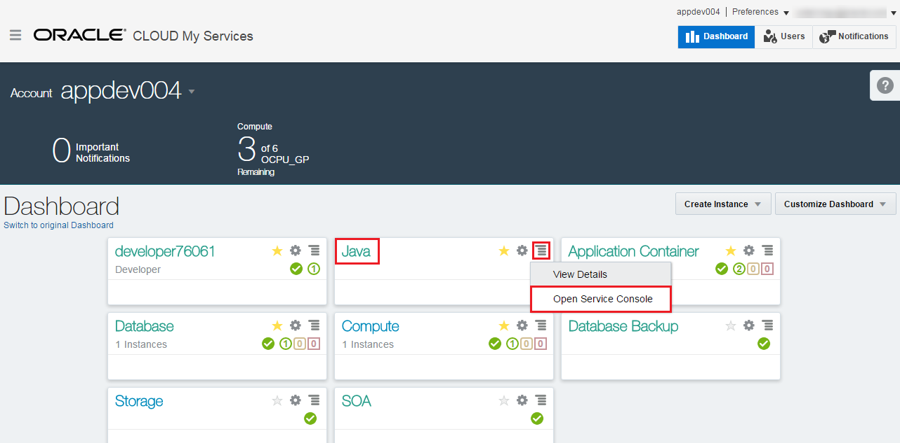

If this is your first time to open the console the Welcome page appears. Click on **Go To Console** or **Services**.
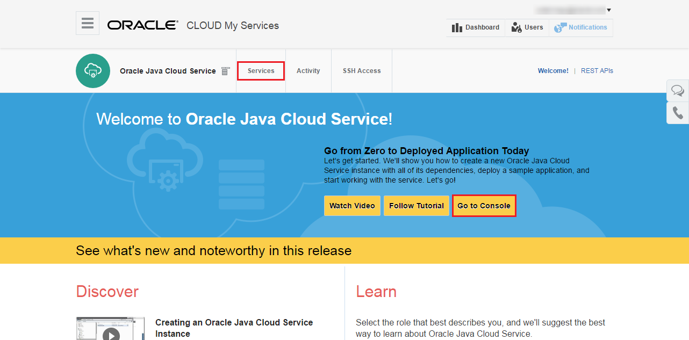

Click **Create Service** and select the **Java Cloud Service — AppToCloud** option.
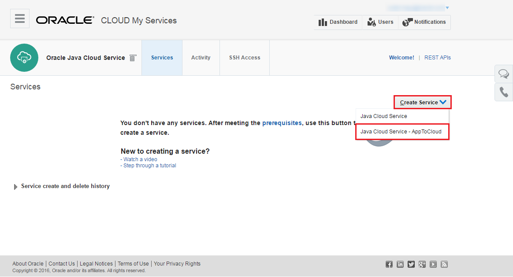

Provide details about the JSON file generated by the Export tool. Enter the fully-qualified name of the JSON file that was uploaded to Oracle Storage Cloud Service. Example: `Storage-MyAccount/Container1/domain1.json`. Enter the name and password of a cloud user that has access to this storage container.
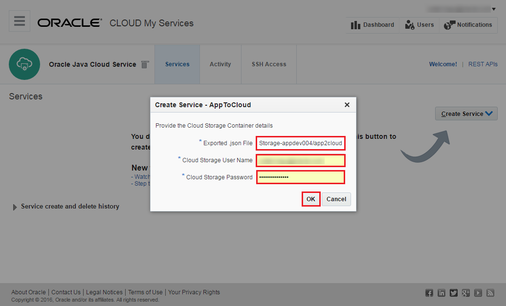

Select **Service Level** and **Billing Frequency**. Click **Next**.
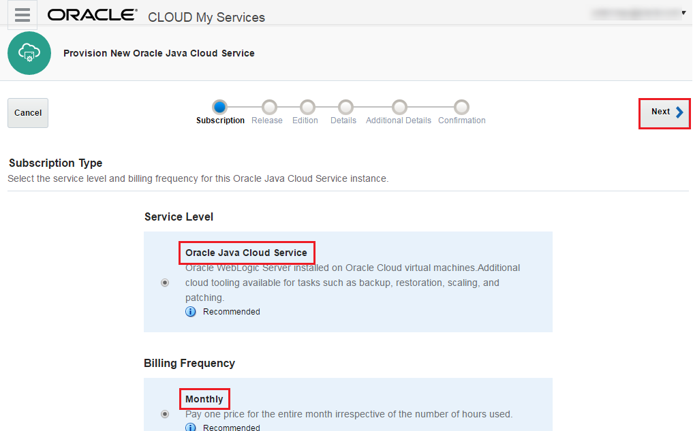

Select **Software Release**. Click **Next**.
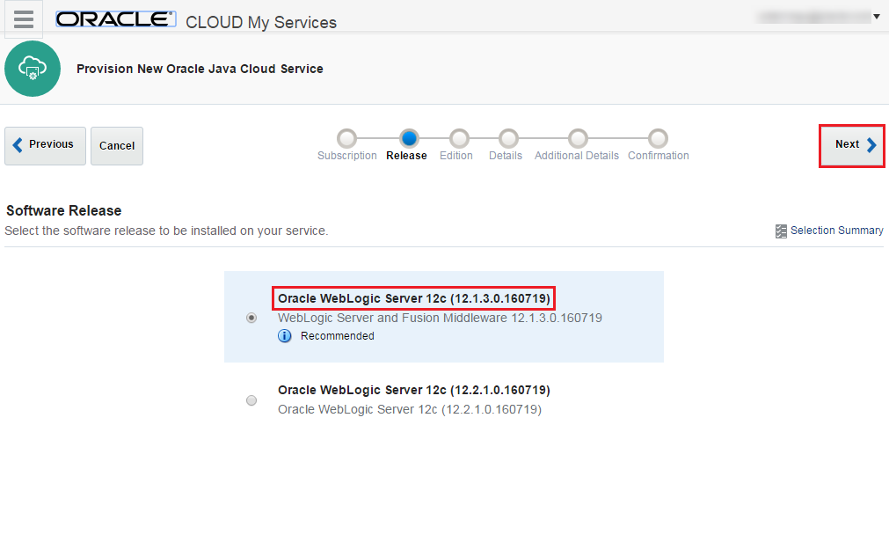

Select **Software Edition**. Click **Next**.
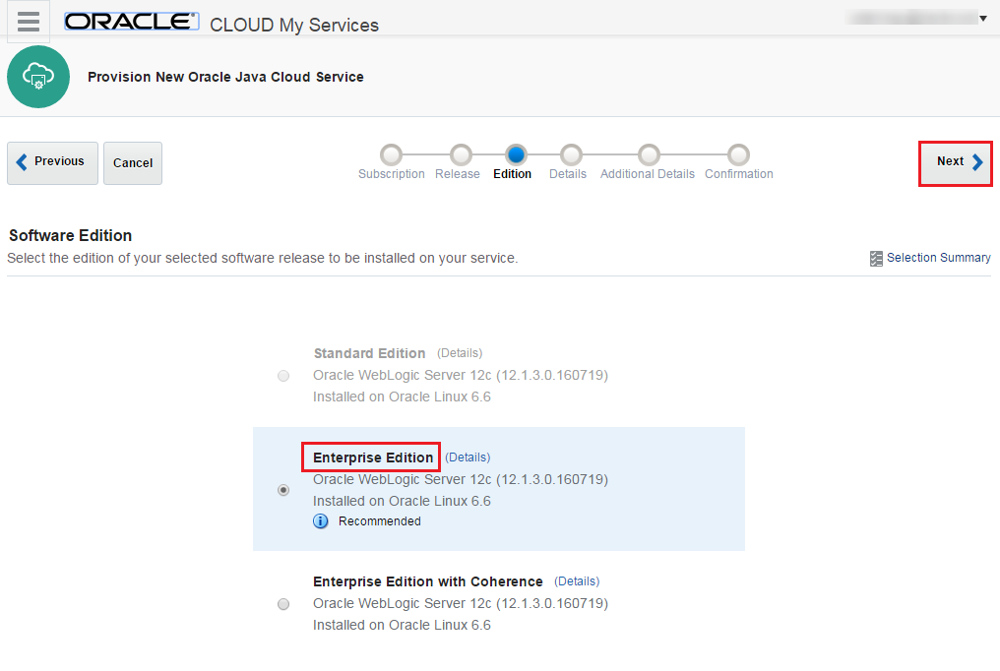

On the Java Cloud Service Details page complete the necessary fields.

- Service name: **petstore**
- Description: optional.
- SSH public key. Use the same what was provided for the Database Cloud Service. That can be found in the `environment.properties` or in the file `public.key` located in `/u01/content/cloud-native-devops-workshop/cloud-utils/`.The parameter name is **ssh.public.key=** if you copy from the `environment.properties`. Click the **Edit** button to open the SSH public key dialog and copy the **ssh.public.key** property value or the `public.key` file's content to the Key Value text area. However you can also create a new key pair if you would like to avoid the find-copy-paste steps.
- Enable access to Administration Consoles: enable.
- Shape: use the default, small instance.
- Username: Weblogic administrator username. For example: *weblogic*
- Password: Weblogic administrator password. For example: *welcome1*
- Cluster size: leave the 2 which is based on the JSON configuration file.
- Cloud Storage container: the path of the container to store backup and configuration related to this Java Cloud Service. Name it to `petstore`. Format is: `Storage-<IDENTITY_DOMAIN>/petstore`.
- Cloud Storage Username: name of a cloud user that has access to this storage container.
- Cloud Storage Password: password of a cloud user that has access to this storage container.
- Create Cloud Storage Container: enable to create the container defined above for Java Cloud Service.
- Database: Database Cloud Service for required schema. As we recommended use the same what was prepared previously for Petstore demo application.
- Database Administrator Username: **sys**.
- Database Password: the password of Database Administrator. If you have not changed the value in the `environment.properties` then it is *Welcome_1*.
- PDB Name: leave *Default* which is usually PDB1.
- Provision Load Balancer: Yes.
- Load Balancer details: leave the default.
 
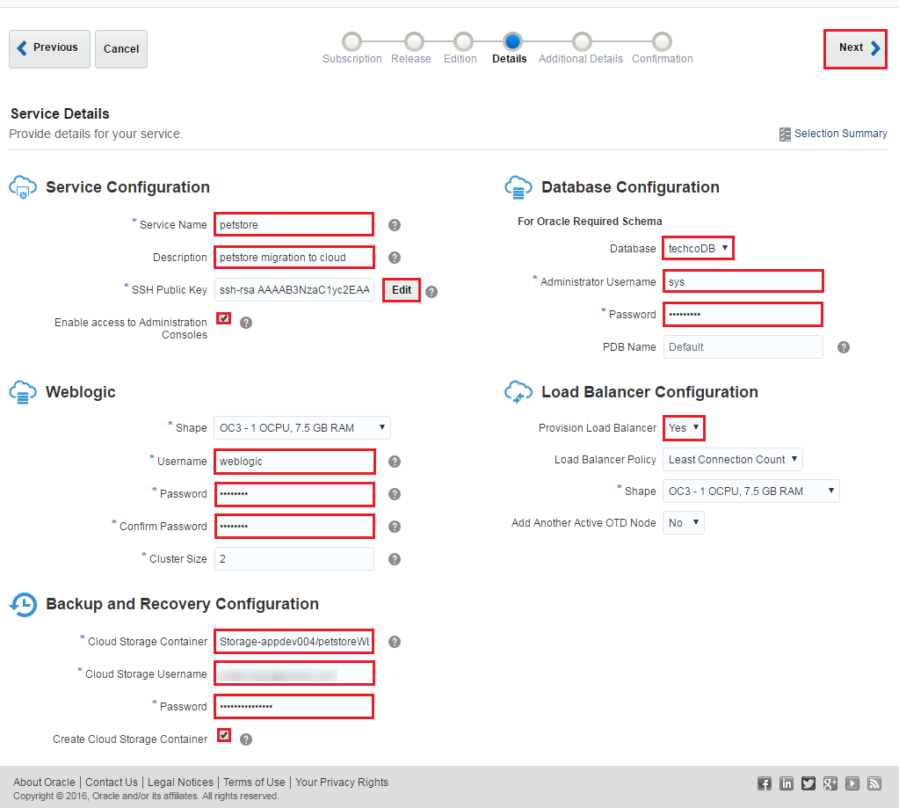

On the **Additional Service Details** screen, select the first **Application Data Source**: *PETSTORE*. Complete the following parameters:

- DBCS Instance: select the Database Cloud Service DBCS Instance for Petstore application and which was also selected to host JRF required schemas on the previous screen.
- Username: **petstore**. This data source will connect to the database as this user.
- Password: the password of Database Administrator. If you have not changed the value in the `environment.properties` then it is *Welcome_1*. (The script has set the same password for **petstore** schema.)
- PDB: leave the **default**.

Click **OK** to accept your changes. Click **Next**.
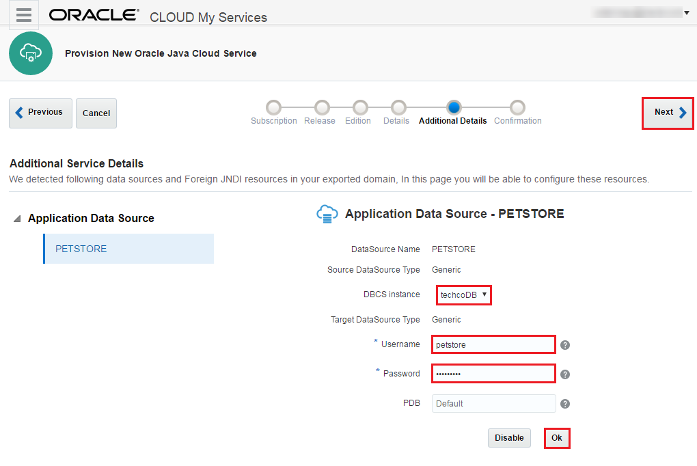

The Confirmation page is displayed. If you are satisfied with your choices click **Create**.
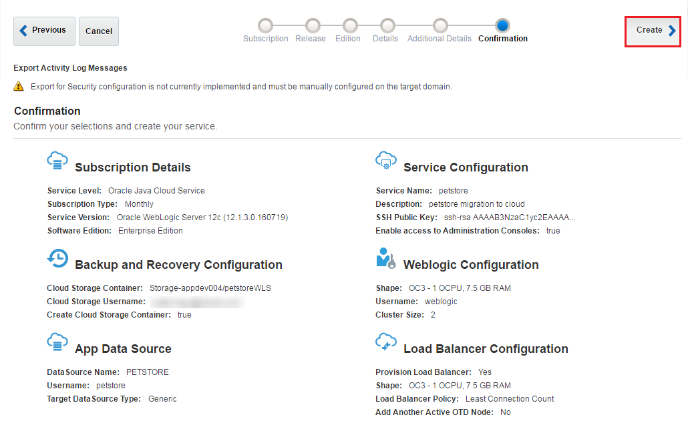

You can use the **Activity** tab to monitor the progress and status of the creation of your service instance. After your service instance is provisioned and is running, you are ready to import the AppToCloud artifacts into the service instance.

#### Importing Applications into a Service Instance ####

After creating an AppToCloud service instance in Oracle Java Cloud Service, perform an import to automatically update the service instance with the applications and other domain resources collected from your on-premises environment.

Locate the AppToCloud service instance that you created previously. Click the hamburger Menu icon adjacent to the service instance name and select **AppToCloud Import**.
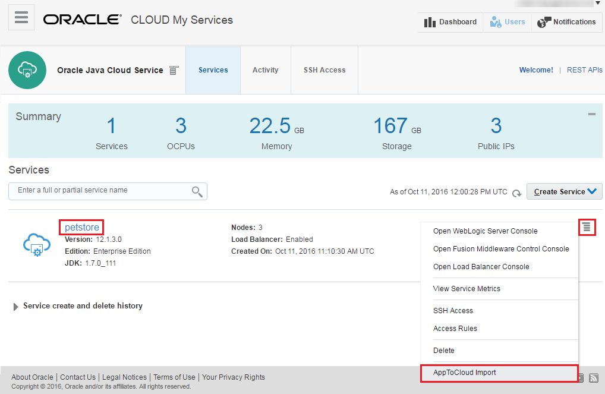

When prompted for confirmation, click **Yes**.
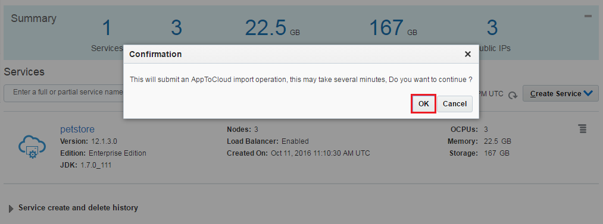

Monitor the progress of the import with the Activity tab. After a successful import, the applications and other domain resources found in your source domain are deployed to your service instance.

To check the Petstore application deployed on Java Cloud Service first we need to get the public IP address of the Load Balancer. Click on the **petstore** Java Cloud Service.
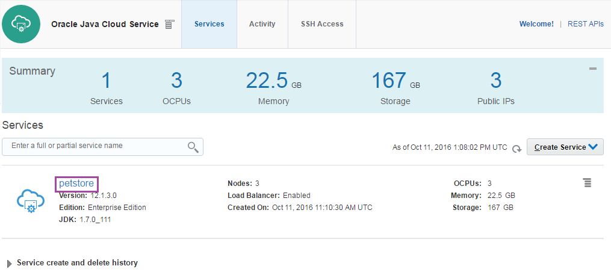

Note the Public IP of the Load Balancer.
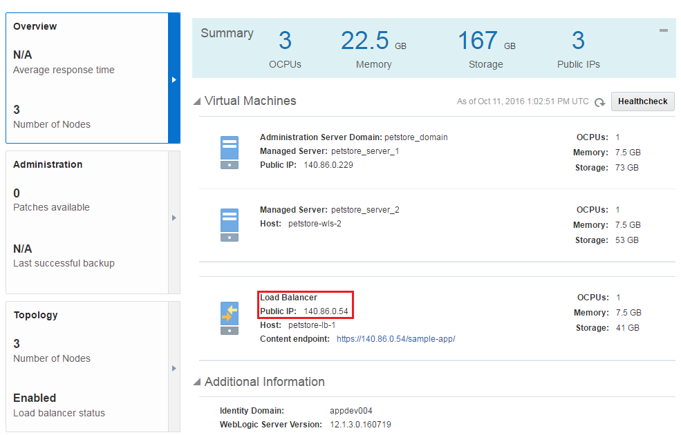

Open a browser and enter the Public IP address of the Load Balancer and append `/petstore/faces/catalog.jsp` to hit the application. The URL should look like this: `http://140.86.0.54/petstore/faces/catalog.jsp`. Don't forget to use your Load Balancer's IP address. 
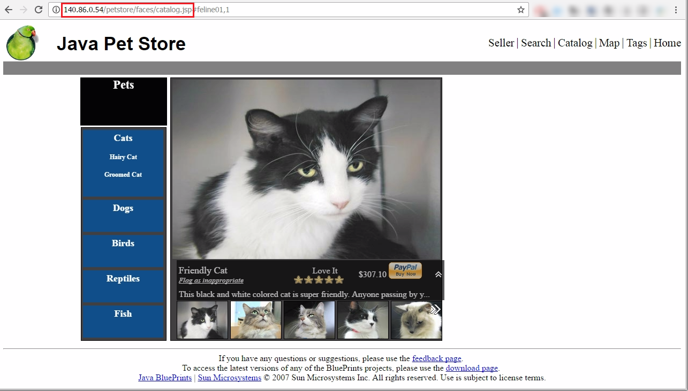

Congratulations! You have successfully migrated your on-premises JEE5 application to Oracle Java Cloud Service using AppToCloud feature.

For more information about AppToCloud migration see the [documentation](http://docs.oracle.com/cloud/latest/jcs_gs/JSCUG/GUID-C1F6804C-8D1C-457C-AC4A-28DD85691D09.htm#JSCUG-GUID-C1F6804C-8D1C-457C-AC4A-28DD85691D09).
