## Scaling Down Nodes in a Java Cloud Service Instance Using the Command Line Interface ##

### Introduction ###
Upon deplying applications to JCS, you may need to scale your JCS instance in response to varying workload. You can scale an Oracle Java Cloud Service instance by scaling a cluster, a node, or the Coherence data tier in the service instance.

You can scale out an Oracle Java Cloud Service cluster to add one node to the cluster. When you scale out, Oracle Java Cloud Service creates a new VM running a WebLogic Server Managed Server instance.

You can also scale up or down a node to change the compute shape, memory, or block storage size, for more information about scaling an Oracle Java Cloud Service Instance. See the [documentation](https://docs.oracle.com/cloud/latest/jcs_gs/JSCUG/GUID-02D79DE3-643B-44B9-A979-340BD472B529.htm#JSCUG3289). In this tutorial, you will go throuh steps to scale down using PSM CLI. Please note that it is also possible to perform the same task using JCS Console.

Oracle offers a PaaS Service Manager (PSM) Command Line Interface (CLI) that enables users of Oracle Application Container Cloud Service, Oracle Database Cloud Service, and Oracle Java Cloud Service to create, monitor and manage their service instances from a command shell or script.

For more information about PSM see the [documentation](https://docs.oracle.com/cloud/latest/jcs_gs/jcs_cli.htm).

### Prerequisites ###

- Running Java Cloud Service with out-of-the-box [sample application](https://docs.oracle.com/en/cloud/paas/java-cloud/jscug/sample-application-deployed-oracle-java-cloud-service-instance.html) deployed
- which has 1 or more nodes with 2 or more OCPUs that may or may not be fronted by JCS Load Balancer
- [cURL command-line tool](http://curl.haxx.se/download.html). Usually cURL is already included in most of the Linux distributions and easy to install to Windows. You can use other tool to invoke REST API to download the latest version of the tool. (To install cURL is not scope of this documentation.)
- Python 3.3 or later. (To install Pyhton is not scope of this documentation.)

### Steps ###
#### Download the latest version of command line tool ####
You can download CLI package using cURL over REST. You can also download it from JCS console directly. We recommend the latter, but both methods are presented below.
First identify your REST API server name. If you log in to your Oracle cloud account with a US data center, use **psm.us.oraclecloud.com** otherwise, use **psm.europe.oraclecloud.com**.

Use cURL to send a request. The format is:

	curl -X GET -u username:password -H X-ID-TENANT-NAME:<identitydomain> https://<rest-server>/paas/core/api/v1.1/cli/<identitydomain>/client -o /u01/psmcli.zip

This will write the response to a file named `psmcli.zip`.

Open a terminal and execute the cURL command above with your credentials, identity domain identifier and REST API server name. REST 

	[oracle@localhost Desktop]$ curl -X GET -u john.i.smith@xxxxx.com:password -H X-ID-TENANT-NAME:hujohni https://psm.europe.oraclecloud.com/paas/core/api/v1.1/cli/hujohni/client -o /u01/psmcli.zip
	% Total    % Received % Xferd  Average Speed   Time    Time     Time  Current
                                   Dload  Upload   Total   Spent    Left  Speed
	100 45968  100 45968    0     0  10993      0  0:00:04  0:00:04 --:--:-- 10999
	[oracle@localhost Desktop]$
Alternatively, you can access **Download Center** under **Help** menu in JCS Console, and download the PSM CLI zip file.
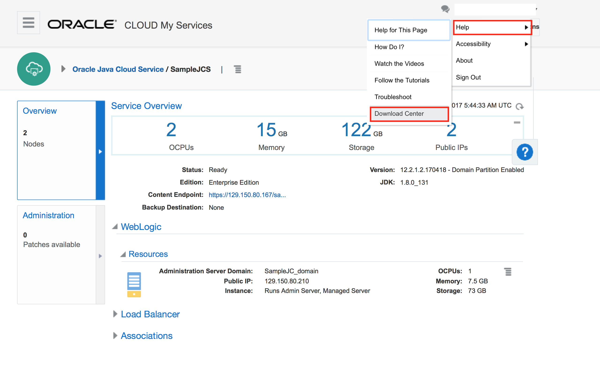
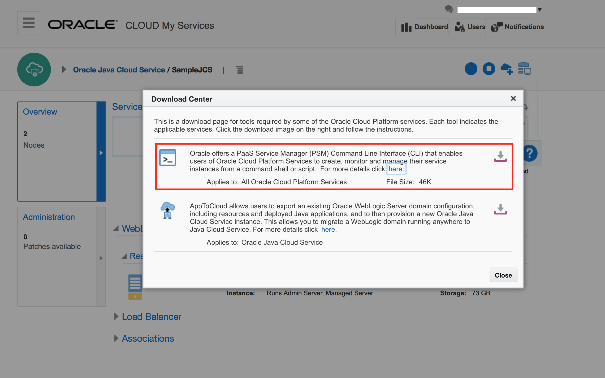

Change to directory `/u01` and list directory to check the downloaded psmcli.zip file.

	[oracle@localhost Desktop]$ cd /u01
	[oracle@localhost u01]$ ls
	app  content  dpct  oepe-12.2.1.4.201608161938  psmcli.zip  python  wins

#### Installing the Command Line Interface ####

Install the PaaS CLI as a Python package.

Open a terminal, change to directory or make sure you are in directory `/u01` and use the PIP tool to install the CLI Python package.
	
	[oracle@localhost Desktop]$ cd /u01
	[oracle@localhost Desktop]$ sudo -H /u01/python/bin/pip3 install -U psmcli.zip
	Processing ./psmcli.zip
	Collecting requests<=2.8.1,>=2.7.0 (from psmcli==1.1.7)
	  Downloading requests-2.8.1-py2.py3-none-any.whl (497kB)
    	100% |████████████████████████████████| 501kB 469kB/s 
	Collecting keyring<=5.6,>=5.4 (from psmcli==1.1.7)
	  Downloading keyring-5.6.tar.gz (69kB)
    	100% |████████████████████████████████| 71kB 1.0MB/s 
	Collecting colorama==0.3.3 (from psmcli==1.1.7)
	  Downloading colorama-0.3.3.tar.gz
	Collecting PyYAML==3.11 (from psmcli==1.1.7)
	  Downloading PyYAML-3.11.zip (371kB)
    	100% |████████████████████████████████| 378kB 725kB/s 
	Installing collected packages: requests, keyring, colorama, PyYAML, psmcli
	  Running setup.py install for keyring ... done
      Running setup.py install for colorama ... done
      Running setup.py install for PyYAML ... done
      Running setup.py install for psmcli ... done
	Successfully installed PyYAML-3.11 colorama-0.3.3 keyring-5.6 psmcli-1.1.7 requests-2.8.1
	You are using pip version 8.1.1, however version 8.1.2 is available.
	You should consider upgrading via the 'pip install --upgrade pip' command.
	[oracle@localhost u01]$

#### Configuring the Command Line Interface ####
Prior to running CLI commands, configure your connection to the Oracle cloud.

Open a terminal and run the `setup` command. When prompted, enter your cloud username, password, region, and identity domain. You may want to enter **json** for output format if you'd like to see details in the response. For example:

	[oracle@localhost u01]$ psm setup
	Username: john.i.smith@xxxxx.com
	Password: 
	Retype Password: 
	Identity domain: hujohni
	Region [us]: emea
	Output format [short]: json 
	----------------------------------------------------
	'psm setup' was successful. Available services are:
	
  	o ANALYTICS : Oracle Analytics Cloud
  	o APICS : Oracle API Platform Cloud Service
  	o BDCSCE : Oracle Big Data Cloud Service - Compute Edition
  	o BigDataAppliance : Oracle Big Data Cloud Service
  	o CONTAINER : Oracle Container Cloud Service
  	o IDCS : Oracle Identity Cloud Service
  	o IDCSControlPlane : Oracle Identity Cloud Service
  	o IOTAssetMon : Oracle IoT Asset Monitoring Cloud Service
  	o IOTEnterpriseApps : Oracle Internet of Things Cloud - Enterprise
  	o IOTFleetMon : Oracle IoT Fleet Monitoring Cloud Service
  	o IOTProdMonitoring : Oracle IoT Production Monitoring Cloud Service
  	o MySQLCS : Oracle MySQL Cloud Service
  	o OEHCS : Oracle Event Hub Cloud Service - Topics
  	o OEHPCS : Oracle Event Hub Cloud Service - Platform
  	o SOA : Oracle SOA Cloud Service
  	o accs : Oracle Application Container Cloud Service
  	o caching : Oracle Application Cache
  	o dbcs : Oracle Database Cloud Service
  	o ggcs : Oracle GoldenGate Cloud Service
  	o jcs : Oracle Java Cloud Service
  	o stack : Oracle Cloud Stack Manager
	----------------------------------------------------
	[oracle@localhost u01]$

The CLI provides help text for each available command. Use the help (or h) parameter to:

View the available services in your configured cloud account. For example:

	[oracle@localhost u01]$ psm help

	DESCRIPTION
  		A command line tool to interact with Oracle Cloud Platform Services (PaaS)

	SYNOPSIS
  		psm <service> <command> [parameters]

	AVAILABLE SERVICES
	  o MySQLCS
	       Oracle Oracle MySQL Cloud Service
	  o accs
	       Oracle Application Container Cloud Service
	  o dbcs
	       Oracle Database Cloud Service
	  o ggcs
	       Oracle GoldenGate Cloud Service
	  o jcs
	       Oracle Java Cloud Service
	  o stack
	       Cloud Stack Manager
	  o setup
	       Configure psm client options
	  o update
	       Update psm client to latest version
	  o log
	       View or update psm client log level
	  o help
	       Show help

	AVAILABLE PARAMETERS
	  -v, --version  
	       Show current version of psm client

	[oracle@localhost u01]$ 

View the available commands for a service:

	[oracle@localhost u01]$ psm jcs help

	DESCRIPTION
	  Oracle Java Cloud Service
	
	SYNOPSIS
	  psm jcs <command> [parameters]
	
	AVAILABLE COMMANDS
	  o services
	       List all Oracle Java Cloud Service instances
	  o service
	       List an Oracle Java Cloud Service instance
	  o create-service
	       Create an Oracle Java Cloud Service instance
	  o import
	       Migrate an OnPremise WLS Domain to the Oracle Java Cloud Service instance
	  o delete-service
	       Delete an Oracle Java Cloud Service instance
	  o stop
	       Stop an Oracle Java Cloud Service instance, Managed Server or load balancer...
	  o start
	       Start an Oracle Java Cloud Service instance, Managed Server or load...
	  o restart
	       Restart an Oracle Java Cloud Service instance, Administration Server,...
	  o scale-out
	       Add a new Managed Server to the specified cluster to scale-out the Oracle...
	  o scale-in
	       Remove a Managed Server to scale-in the Oracle Java Cloud Service instance...
	  o scale-up
	       Scale the specified Administration Server or Managed Server node on an...
	  o scale-down
	       Scale the specified Administration Server or Managed Server node on an...
	  o view-backup-config
	       List backup configuration of an Oracle Java Cloud Service instance
	  o update-backup-config
	       Update backup configuration of an Oracle Java Cloud Service instance
	  o view-backups
	       List all backups of an Oracle Java Cloud Service instance
	  o view-backup
	       List a backup of an Oracle Java Cloud Service instance
	  o backup
	       Initiate an on-demand backup for an Oracle Java Cloud Service instance
	  o delete-backup
	       Delete a backup of an Oracle Java Cloud Service instance
	  o view-restores
	       List all restore operations for an Oracle Java Cloud Service instance
	  o view-restore
	       List a specified restore operation for an Oracle Java Cloud Service instance.
	  o restore
	       Restore an Oracle Java Cloud Service instance from the specified backup....
	  o available-patches
	       List all available patches for an Oracle Java Cloud Service instance
	  o applied-patches
	       List all applied patches for an Oracle Java Cloud Service instance
	  o precheck-patch
	       Precheck to identify potential issues that might prevent the specified...
	  o patch
	       Apply a patch to an Oracle Java Cloud Service instance
	  o rollback
	       Roll back a patch for an Oracle Java Cloud Service instance
	  o operation-status
	       View status of an Oracle Java Cloud Service instance operation
	  o access-rules
	       List access rules for Oracle Java Cloud Service instance
	  o create-access-rule
	       Create an access rule for Oracle Java Cloud Service instance
	  o delete-access-rule
	       Delete an access rule for Oracle Java Cloud Service instance
	  o enable-access-rule
	       Enable an access rule for Oracle Java Cloud Service instance
	  o disable-access-rule
	       Disable an access rule for Oracle Java Cloud Service instance
	  o help
	       Show help

	[oracle@localhost u01]$ 

View the available parameters for a specific command along with examples.
	
	[oracle@localhost Desktop]$ psm jcs create-service help
	
	DESCRIPTION
	  Create an Oracle Java Cloud Service instance
	
	SYNOPSIS
	  psm jcs create-service [parameters]
	       -c, --config-payload <value>
	       [-of, --output-format <value>]
	
	AVAILABLE PARAMETERS
	  -c, --config-payload    (file)
	       Path to JSON file containing Oracle Java Cloud Service provisioning
	       configuration parameters
	
	  -of, --output-format    (string)
	       Desired output format. Valid values are [json, html]
	
	EXAMPLES
	  psm jcs create-service -c /home/templates/create-jcs-service.json
	
	[oracle@localhost Desktop]$ 

#### Use the Command Line Interface to Scale Down a JCS Node ####
First list the Java Cloud Services in your configured identity domain:

	[oracle@localhost Desktop]$ psm jcs services
	{
    	"uri":"https://psm.us.oraclecloud.com/paas/service/jcs/api/v1.1/instances/abcXYZ",
    	"service_type":"jaas",
    	"implementation_version":"1.0",
    	"services":[
        	{
            	"service_name":"SampleJCS",
            	"version":"12cRelease212",
            	"wlsVersion":"12.2.1.2.170418",
            	"status":"Running",
            	"error_status_desc":"",
            	"compliance_status":"",
            	"compliance_status_desc":"",
            	"auto_update":"true",
            	"description":"Scaling lab with sample app",
            	"identity_domain":"abcXYZ",
            	"creation_time":"2017-08-02T19:56:31.801+0000",
            	"last_modified_time":"2017-08-02T19:56:30.827+0000",
            	"created_by":"john.smith@oracle.com",
            	"clone":false,
            	"service_uri":"https://psm.us.oraclecloud.com/paas/service/jcs/api/v1.1/instances/abcXYZ/SampleJCS"
        	},
        	{
            	"service_name":"petstore",
            	"version":"12cR3",
            	"wlsVersion":"12.1.3.0.170418",
            	"status":"In Progress",
            	"error_status_desc":"",
            	"compliance_status":"",
            	"compliance_status_desc":"",
            	"auto_update":"true",
            	"description":"petstore app2cloud demo",
            	"identity_domain":"abcXYZ",
            	"creation_time":"2017-08-01T21:28:16.946+0000",
            	"last_modified_time":"2017-08-02T01:12:29.361+0000",
            	"created_by":"john.smith@oracle.com",
            	"clone":false,
            	"service_uri":"https://psm.us.oraclecloud.com/paas/service/jcs/api/v1.1/instances/abcXYZ/petstore"
        	}
    	]
	}
	

You may see different output depending on the JCS service instances you may have in your account. To get more details about specific service use **psm service -s [servicename]** command where you will need to provide the JCS service instance name for [servicename]:

	[oracle@localhost Desktop]$ psm jcs service -s SampleJCS
	{
    	"service_name":"SampleJCS",
    	"version":"12cRelease212",
    	"wlsVersion":"12.2.1.2.170418",
    	"status":"Running",
    	"error_status_desc":"",
    	"compliance_status":"",
    	"compliance_status_desc":"",
    	"auto_update":"true",
    	"description":"Scaling lab with sample app",
    	"identity_domain":"abcXYZ",
    	"creation_time":"2017-08-02T19:56:31.801+0000",
    	"last_modified_time":"2017-08-02T19:56:30.827+0000",
    	"created_by":"john.smith@oracle.com",
    	"clone":false,
    	"service_uri":"https://psm.us.oraclecloud.com/paas/service/jcs/api/v1.1/instances/abcXYZ/SampleJCS",
    	"domain_name":"SampleJC_domain",
    	"domain_mode":"PRODUCTION",
    	"cluster_name":"SampleJC_cluster",
    	"num_nodes":2,
    	"level":"PAAS",
    	"subscription_type":"MONTHLY",
    	"edition":"EE",
    	"shape":"oc3",
    	"isManaged":false,
    	"otd_provisioned":"yes",
    	"loadbalancer_configured":"no",
    	"identity_service":"no",
    	"otd_shape":"oc3",
    	"otd_storage_size":50176,
    	"ocpu_count":3,
    	"memory_size":22.5,
    	"storage_size":122,
    	"service_components":[
        	{
            	"type":"OTD_JDK",
            	"version":"1.8.0_131"
        	},
        	{
            	"type":"OTD",
            	"version":"12.2.1.2.0"
        	},
        	{
            	"type":"WLS",
            	"version":"12.2.1.2.170418"
        	},
	{
            	"type":"JDK",
            	"version":"1.8.0_131"
        	}
    	],
    	"creation_job_id":"14088641",
    	"deletion_job_id":0,
    	"db_info":"//DBCS-AppDev1:1521/AppDev1.abcXYZ.oraclecloud.internal",
    	"db_service_name":"DBCS-AppDev1",
    	"db_service_uri":"https://psm.us.oraclecloud.com/paas/service/dbcs/api/v1.1/instances/abcXYZ/DBCS-AppDev1",
    	"useStackTag":"false",
    	"_loginfra_enabled_":"false",
    	"num_ip_reservations":2,
    	"wls_admin_url":"https://129.152.80.210:7002/console",
    	"fmw_control_url":"https://129.152.80.210:7002/em",
    	"cloud_ip":"129.152.80.210",
    	"otd_admin_url":"https://129.152.80.167:8989/em",
    	"sample_app_url":"https://129.152.80.167/sample-app/",
    	"secure_content_url":"https://129.152.80.167",
    	"wls_deployment_channel_port":9001,
    	"psm_plugin_version":"17.3.1-547",
    	"region":"uscom-central-1",
    	"db_associations":[
        	{
            	"db_service_name":"DBCS-AppDev1",
            	"db_infra":true,
            	"db_app":false,
            	"db_connect_string":"//DBCS-AppDev1:1521/AppDev1.abcXYZ.oraclecloud.internal",
            	"pdb_service_name":"AppDev1",
            	"db_version":"12.1.0.2",
            	"db_em_url":"https://129.152.80.19:5500/em",
            	"db_apex_url":"https://129.152.80.19/apex/appdev1/",
            	"db_monitor_url":"https://129.152.80.19/dbaas_monitor",
            	"db_service_level":"PAAS"
        	}
    	]
	}
	
	
	[oracle@localhost Desktop]$ 

Leave this terminal open.

#### Monitor Scale-Down Operation on the Java Cloud Service Console ####
Navigate to the Oracle Java Cloud Service Console.[Sign in](../common/sign.in.to.oracle.cloud.md) to [https://cloud.oracle.com/sign-in](https://cloud.oracle.com/sign-in). On the dashboard open the Java Cloud Service Console.

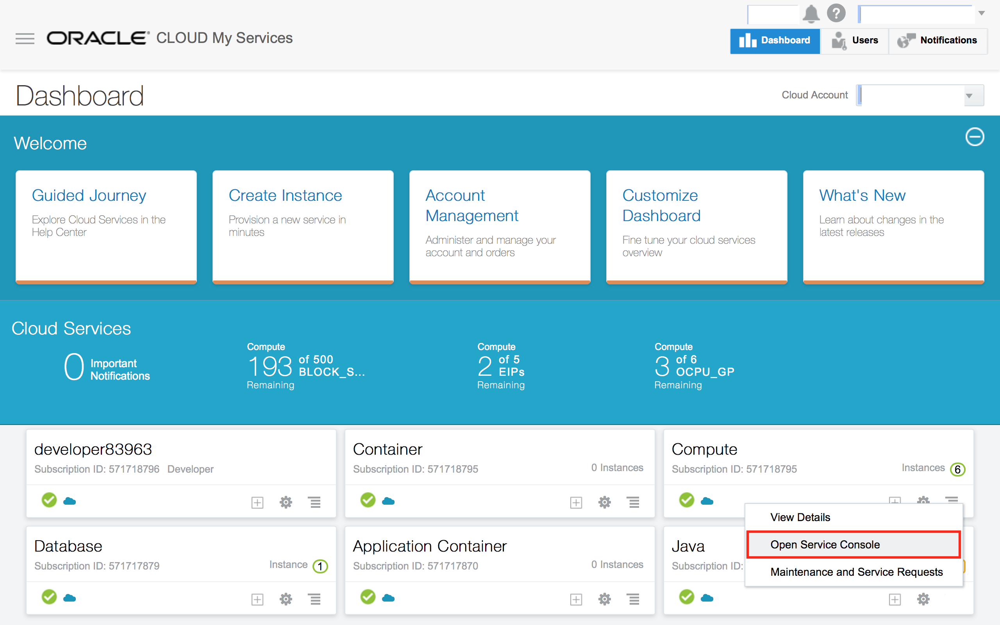

Click the service instance hosting sample application. If you have a JCS service instance with a different application that has been deployed successfully, you can continue the lab with that instance too. The deployed and running application here is used only to validate the scale-up or scale-down operation is successful.

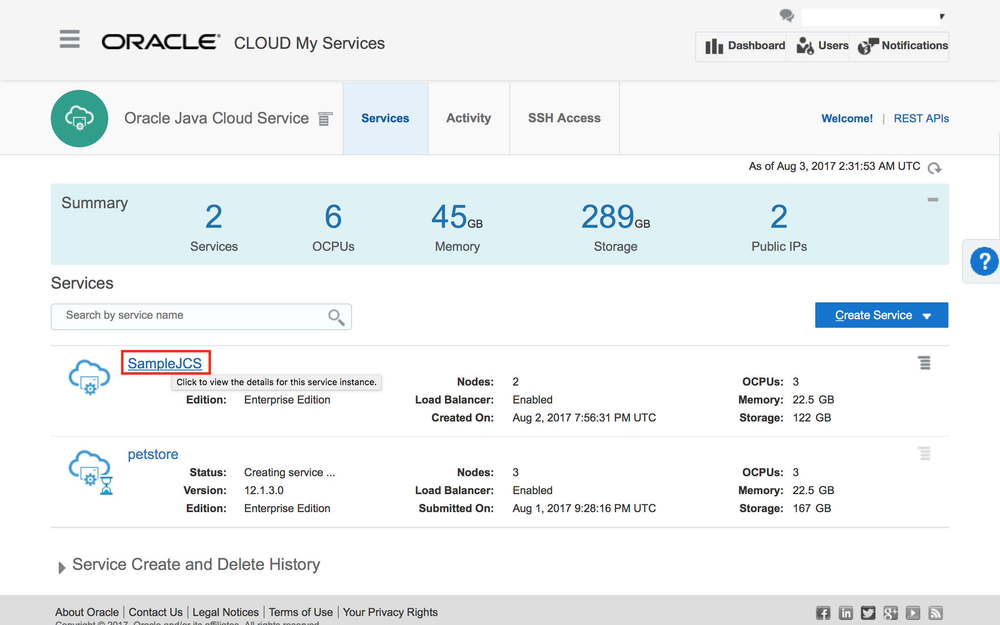

First, check whether the application is up and running by clicking the **Content Endpoint** url, which consists of the public IP address of your load balancer, if one is configured for the service, or the public address of one of the WLS node and root context of the application.

Come back to **JCS Service Instance Detail** page. Take the note of the number of OCPUs of the WLS node that you want to scale up in the **WLS/Resources** section under **Service Overview**. In this particular scenario, the selected node is currently consuming 2 OCPU.

Go back to the terminal where psm was used and get the help of the scale-down command.

	[oracle@localhost Desktop]$ psm jcs scale-down help
	DESCRIPTION
  	Scale the specified Administration Server or Managed Server node on an Oracle
  	Java Cloud Service instance to decrease its compute shape.
  	
  	You can scale down only the Administration Server node and Managed Server
  	nodes in a WebLogic Server cluster, Oracle Java Cloud Service does not support
  	scaling down for other nodes in a service instance, such as the load balancer
  	node or capacity unit nodes in the Coherence data tier.
  	
  	You cannot remove block storage from a storage volume.
	
	SYNOPSIS
  	psm jcs scale-down [parameters]
       	-s, --service-name <value>
       	-p, --shape <value>
       	-n, --server-name <value>
       	[-of, --output-format <value>]
	
	AVAILABLE PARAMETERS
  	-s, --service-name    (string)
       	Name of the Oracle Java Cloud Service instance
	
  	-p, --shape    (string)
       	Desired Oracle Compute Cloud shape to scale the Oracle Java Cloud Service
       	instance down to. This attribute is required. If you do not want to change the
       	compute shape, set this value to match the current compute shape.
       	Allowed values are,
       	1) oc3 (1 OCPU with 7.5 GB RAM)
       	2) oc4 (2 OCPUs with 15 GB RAM)
       	3) oc5 (4 OCPUs with 30 GB RAM)
       	4) oc6 (8 OCPUs with 15 GB RAM)
       	5) oc1m (1 OCPU with 15 GB RAM)
       	6) oc2m (2 OCPUs with 30 GB RAM)
       	7) oc3m (4 OCPUs with 60 GB RAM)
       	8) oc4m (8 OCPUs with 120 GB RAM)
	
  	-n, --server-name    (string)
       	Name of the node (Administration Server or Managed Server) for which you want
       	to decrease block storage capacity.
	
  	-of, --output-format    (string)
       	Desired output format. Valid values are [short, json, html]
	
	EXAMPLES
  	psm jcs scale-down -s ExampleInstance -n ExampleI_server_1 -p oc4	
	
	[oracle@localhost Desktop]$ 

According to the help, give the necessary parameters to scale down the WLS node of your choice in the target JCS service instance. In the example below, please replace **SampleJCS** with your JCS instance name, and **SampleJC_server_1** with the name of the node which you want to scale down, and **oc3** with the shape you want to scale down to. **oc3** means you want to use one OCPU for that node.

	[oracle@localhost Desktop]$ psm jcs scale-down -s SampleJCS -n SampleJC_server_1 -p oc3
	{
    	"status":"New",
    	"details":{
        	"message":"scaleup.job.submitted$13958988$SampleJCS$SampleJC_server_1$oc3$",
        	"jobId":"13958988"
    	}
	}
	Job ID : 13958988
	[oracle@localhost Desktop]$ 

The response shows the Scaling Down Job has been submitted. You can get further information about the job using the provided jobId in the answer. Obviously if you have different service and/or managed server name then replace the parameters to reflect your environment properties.

Come back to JCS Service Console page by clicking **Oracle Java Cloud Service** in the breadcrum. You will notice that the service instance is now in the **Service Maintenance** status.

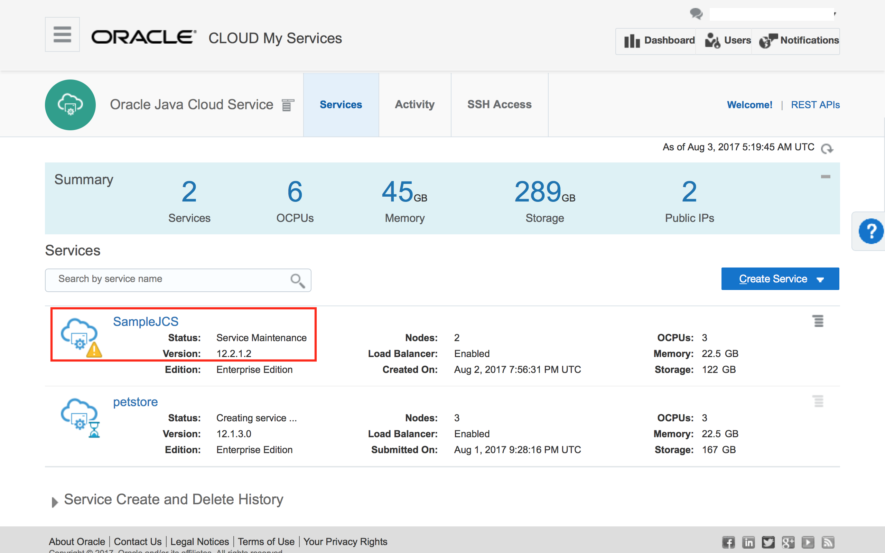

Click **Activity** tab, and you will a new **Scale Up/Down** operation has started.
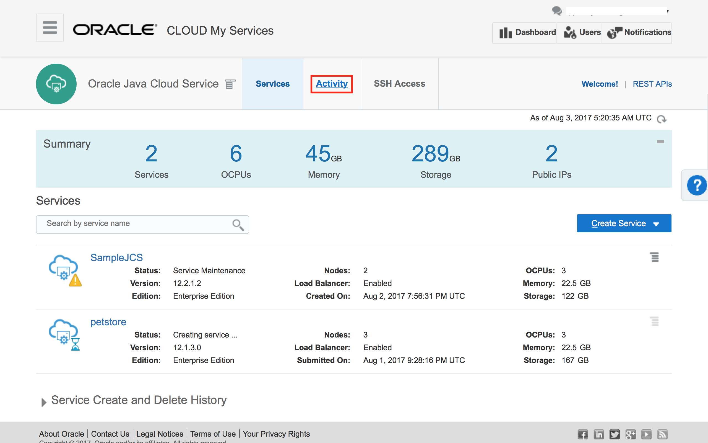
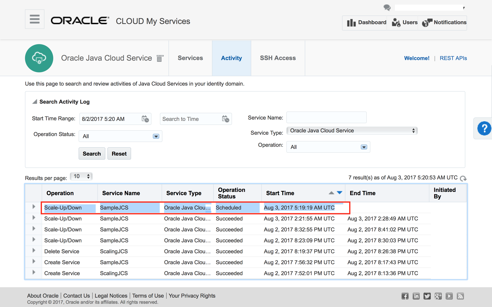

It takes about 3 - 8 minutes to complete the operation. You can click the arrow icon on the leftmost column to see the details and press the refresh button right above the activiy table to check the operation status. 
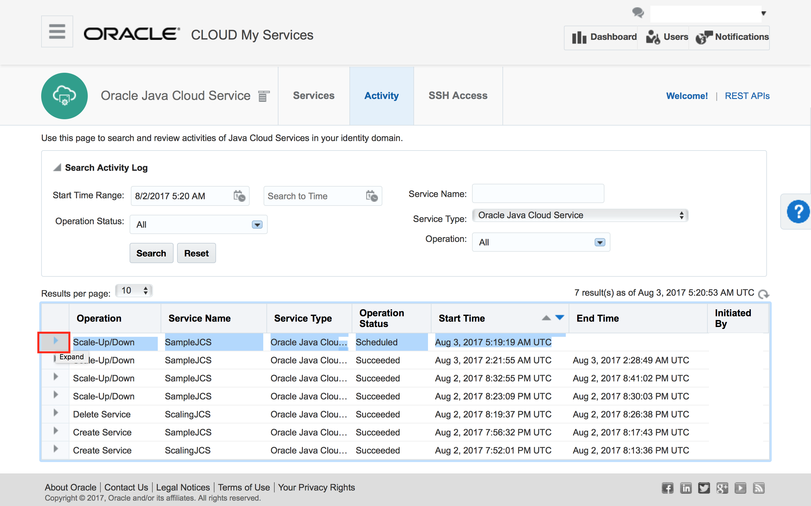
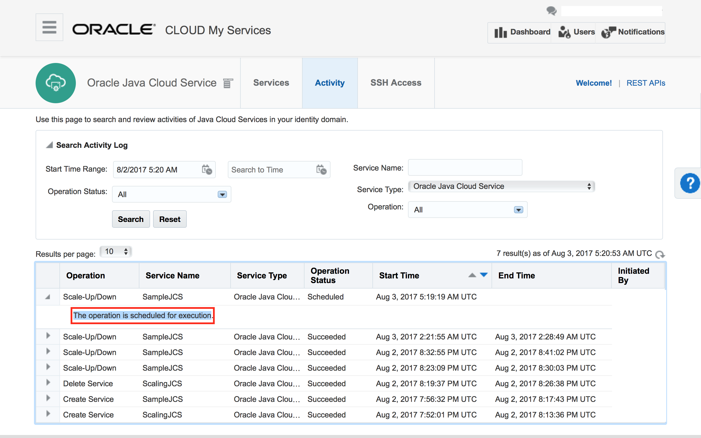

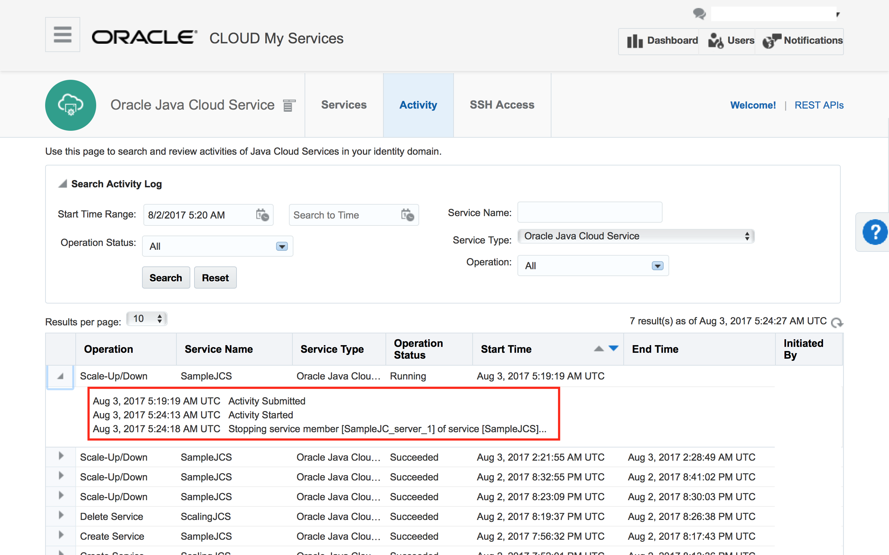
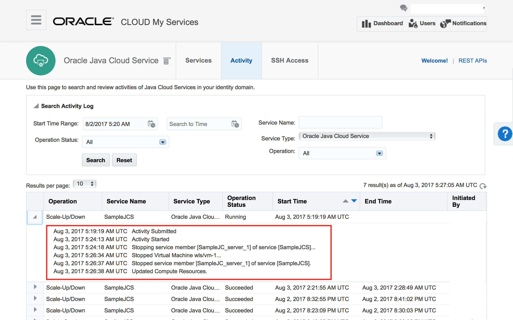

You will also notice that the number of OCPUs of the node is marked with an asterisk(\*) on the service details page to indicate that the scale-down process is under way. Come back to **Activity** tab, and wait until you see the operation is completed.
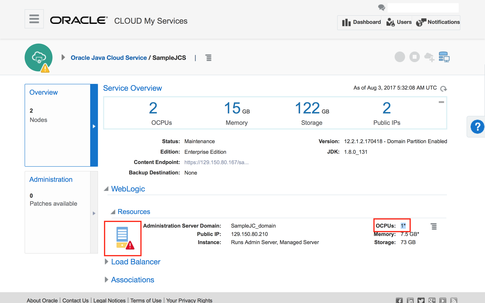

Click the **Services** tab at the top, and select the JCS service instance for which the scale-down operation was performed.  In the **Service Instance Details** page, you will notice that the number of OCPUs of the WLS node that you chose to scale down in the **WLS/Resources** section under **Service Overview** has changed accordingly. In this particular scenario, the selected node is now consuming 1 OCPU as per **oc3** parameter given in psm scale-down command above.

Just to check whether the application is still up and running after scale-up, click the **Content Endpoint** link as before. You should see the application on a new browser tab.

