# ORACLE Cloud-Native DevOps workshop #

## Build Node.js-MongoDB container packaged application using Wercker and deploy to Oracle Container Cloud Service ##

### About this tutorial ###
**Wercker** is a Docker-Native CI/CD  Automation platform for Kubernetes & Microservice Deployments. Wercker is integrated with Docker containers, which package up application code and can be easily moved from server to server. Each build artifact can be a Docker container. The user can take the container from the Docker Hub or his private registry and build the code before shipping it. Its SaaS platform enables developers to test and deploy code often. They can push software updates incrementally as they are ready, rather than in bundled dumps. It makes it easier for coders to practice continuous integration, a software engineering practice in which each change a developer makes to the codebase is constantly tested in the process so that software doesn’t break when it goes live.

**Oracle Container Cloud Service** provides an easy and quick way to create an enterprise-grade container infrastructure. It delivers comprehensive tooling to compose, deploy, orchestrate and manage Docker container-based applications on the Oracle Public Cloud. It is designed to provision a ready to run containerized infrastructure quickly, that can be used as a test infrastructure, with a limited lifespan, or operated as a production environment for long running container applications.

Oracle Container Cloud Service provides feature called stack. The stack comprises all of the necessary configuration for running a set of services in a coordinated way, managed as a single entity, plus default deployment options. Note that stacks themselves are neither containers nor images running in containers, but rather are high-level configuration objects that you can create, deploy, and manage using Oracle Container Cloud Service.

In this example, stack contains a MongoDB container and the containerized sample Node.js application.

**Architecture**

This tutorial demonstrates how to:

- create Wercker application (CI/CD) to build, package and push Node.js sample application to Docker public repository
- create Oracle Container Cloud Service based on containerized Node.js sample application
- create Oracle Container Cloud Stack which contains the Node.js sample application and MongoDB services.
- deploy stack to Oracle Container Cloud Service

### Prerequisites ###

- [Github](https://github.com) account
- [Oracle Public Cloud Service](https://cloud.oracle.com) account including Container Cloud Service
- [Docker](https://cloud.docker.com/) account to have Docker registry.

----
#### Create Oracle Container Cloud Service instance ####

If you already have Container Cloud Service instance you can skip this step.

First create Oracle Container Cloud Service. Sign in to [https://cloud.oracle.com/sign-in](https://cloud.oracle.com/sign-in). Select your datacenter then provide the identity domain and credentials. After a successful login you will see your Dashboard. Find the Container tile and click the hamburger icon. In the dropdown menu click **Open Service Console**.

If it is the first time you launch this console then click **Go To Console** button on the Wizard page. Otherwise click immediately the **Create Service** button.

On the details page configure the service.

+ **Service Name**: name of the instance. E.g. *testOCCS*
+ **Description**: short description of the service. Can be anything which describes the purpose of this service.
+ **SSH Public Key**: to connect to the worker and master nodes you need to define your public key of your SSH keypair. Press the **Edit** button. In case if you already have one and you want to use that select the public key file or copy of that content into Key Value textfield. Otherwise and for test purposes I recommend to generate a new one. Select **Create a New Key** option and click **Enter**. A popup dialog will open which enables to download the newly generated key pair. It is important to have this key pair for later usage of this service. In case if you lost or forget where you saved the key pair you can [add new one](https://docs.oracle.com/cloud/latest/computecs_common/OCSUG/GUID-65AA23D4-5F57-4EF6-9704-C8E16932C0AD.htm#OCSUG233) using the My Services Dashboard.

+ **Metering Frequency**: based on your subscription. Leave the default.
+ **Admin Username**: administrator's username of Container Cloud Service's console. You can leave the default.
+ **Admin Password**: administrator's password. Please note the password what you choose.
+ **Worker node Compute Shape**: the capacity of the service. For this sample the minimum is more than enough.
+ **Number of worker nodes**: The number of worker nodes which run the Docker containers. For this sample the default 1 node is enough. One node can execute more containers even if that share one OCPU only. Every worker node has a public IP address assigned what makes the running application publicly available.
+ **Worker node data volume size (GB)**: Leave the default.

Once all the details are configured click **Next**.

Check again the configuration and submit the instance provision request by clicking **Next**.

While the Container Cloud Service provisioning completes move forward to sign up Docker and create Wercker continous integration setup. 

#### Sign up to Docker ####

If you already have Docker account you can skip this step.

Go to [https://cloud.docker.com/](https://cloud.docker.com/) than choose your *Docker ID* enter your email address and a desired password. Click **Sign up**.

Now check your inbox and you should get a similar email. Click the **Confirm Your Email** button.

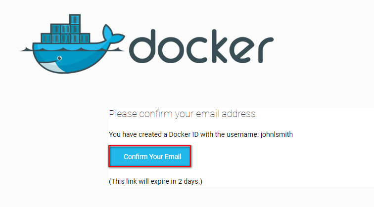

You can login now using your new Docker account.

#### Fork Node.js sample sources into your github repository ####

First make sure you are signed in to [https://github.com](https://github.com) using your account and than go to [https://github.com/nagypeter/nodejs-mongodb-crud](https://github.com/nagypeter/nodejs-mongodb-crud). In case you don't have Github account then please [sign up](https://github.com/join?source=header-home).

Now click **Fork**.

When the fork is done move to the next step.

#### Sign up to Wercker using your Github account ####

When the import is done go to [https://app.wercker.com](https://app.wercker.com) and sign up using your github account. Click the **LOG IN WITH GITHUB** button.

If you use the same browser where you are already signed in to github then it will go directly to *Authorize application* github page. If not then enter your github's credentials to sign in to github. Click the **Authorize application** button to accept Wercker's request. You can revoke Wercker's authorization request anytime using your github's profile settings.

After the successfull authorization you will be redirected to *https://app.wercker.com*.

#### Create Wercker Application to build Docker container including Node.js sample application ####

Now here is the time to create your Wercker application. Wercker acts as continuous integration tool which will produce and push a complete Docker container including the Node.js sample application bits.

Go back to the Wercker's welcome page and click **Create your first application** button or the **+Create** dropdown list and select *Application*.

First select the repository you want to use as sources. By default it will show your Github provider and the available repositories. Select *node-mongodb-crud* and click **Use selected repo**.

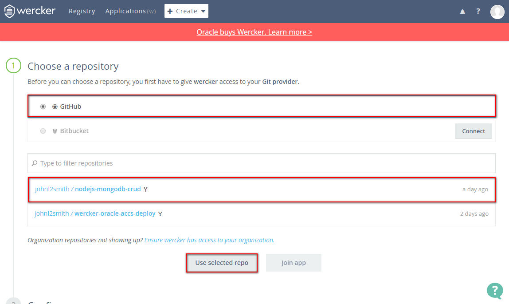

In case of private repositories you should define the access method. Since the the sample repository created as public you can leave the default checkout method. Click **Next step**.

Finally you can choose whether your application is public or not. We recommend to leave default which means the application will be private. Click **Finish** to create your application.

The next page offers to generate specific wercker.yml based on the application's language. This sample application already has one so click the **trigger a build now** link.

Now the default *build* pipeline starts to run which is a simple *npm install* -defined in *wercker.yml*- to get necessary node modules for Node.js sample application. The result should be successfull. You can open each step (on the right side) to get more details.

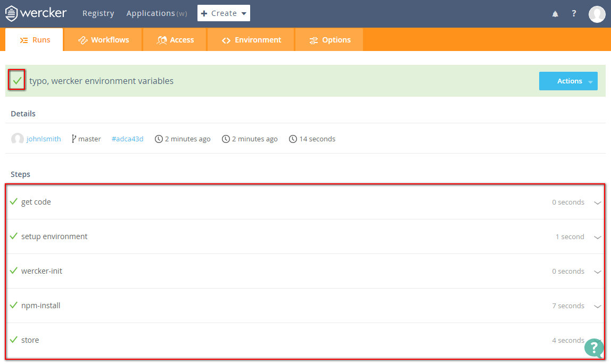

Before you move forward please inspect the *wercker.yml*. The source is available under your github repository. Open a new browser (tab) and go directly to *https://github.com/<YOUR_GITHUB_USERNAME>/nodejs-mongodb-crud/blob/master/wercker.yml*. The configuration should be the same:

	box: node:6.10
	build:
	  steps:
	    # A step that executes `npm install` command
	    - npm-install
	push:
	  steps:
	    # Push to public docker repo
	    - internal/docker-push:
	        username: $DOCKER_USERNAME
	        password: $DOCKER_PASSWORD
	        tag:  $DOCKER_TAG
	        repository: $DOCKER_REPOSITORY
	        registry: https://index.docker.io/v1/
	        cmd: node pipeline/source/app.js

The *wercker.yml* defines the configuration of your automation pipelines with a collection of Steps that you wish to execute.
In your *wercker.yml* you can specify any pipeline you like. There is one special pipeline called `dev` which will only be executed when running it with the CLI using the wercker dev command. Examples of pipeline names: *build-base-container*, *build*, *push-to-registry*, etc.

A pipeline can have its own base box (Docker container), like in this example the *node:6.10* official Node Docker container. You can use different base boxes per pipeline.

As you can see in this configuration we have the default pipeline *build* which executes the *npm-install* build and a *push* step which is not a reserved pipeline. You will create *push* pipeline in the next step. This is why you couldn't see the Docker push step in the first build.

Please also note the environment variables usage. After the *push* pipeline you will create these variables and set the values.

Now switch to **Workflows** tab.

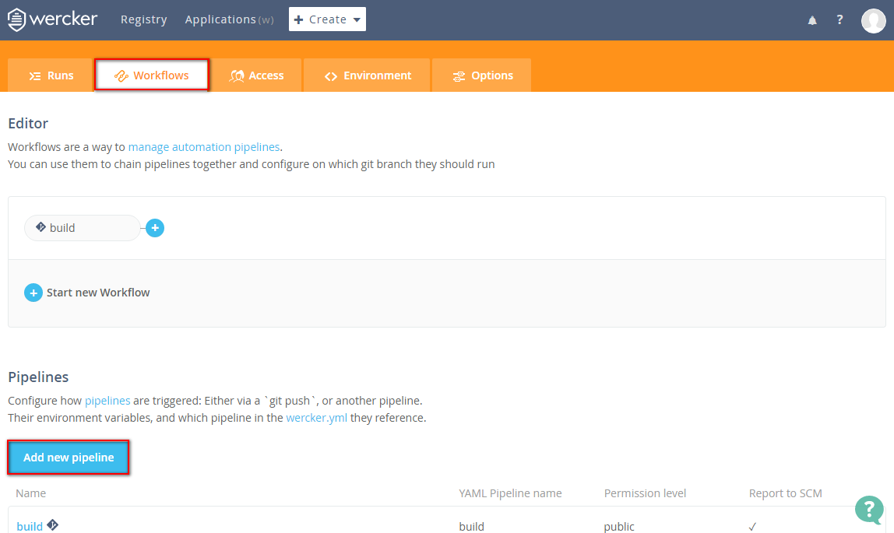

As mentioned upon creating a project in Wercker, it creates a *build* Workflow with a Git hook which executes a build pipeline. This means whenever you push changes into your github repository then a new build will be triggered. Now add a new pipeline what will do the Docker container image push to your Docker registry. Click *Add new pipeline*.

+ **Name**: *push-docker* (but can be anything else)
+ **YML Pipeline name**: it has to be *push*, because we already defined this pipeline in  the *wercker.yml*.
+ **Hook type**: leave default to ignore Git push. You will add this pipeline after build what has already this configuration.

Finally click **Create**.

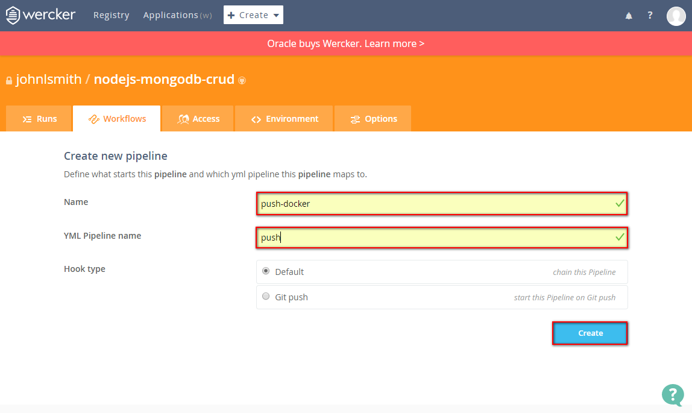

On the detail page of the new *push-docker* pipeline you can immediately add the required environment variables.

+ **DOCKER\_USERNAME** = your Docker username
+ **DOCKER\_PASSWORD** = your Docker password
+ **DOCKER\_TAG** = latest
+ **DOCKER\_REPOSITORY** = <YOUR\_DOCKER\_USERNAME>/nodejs-mongodb-crud

When you need to add new variable click **Add** button which saves the current row and add a new one. You can use the **Protected** tick box to store safely your value e.g. password.

To go back workflow editor click **Workflows** tab again and start to edit your workflow. Click the blue plus icon after the *build* pipeline to add the previosly created *push-docker* pipeline. Leave the default * for branches and select the *push-docker* pipeline from the **Execute pipeline** dropdown list. Click **Add**.

To execute the workflow go back to **Runs** and select the last successful build.

Click the **Action** button and select the **Execute this pipeline again** menu item.

Enter a proper message to easily identify later the reason of the run and Push the **Execute pipeline** button.

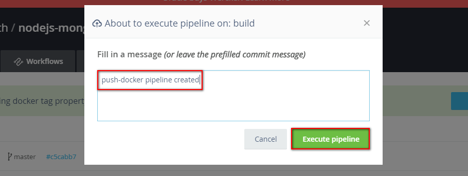

Click Runs tab again and verify the successful run of the *build* and *push-docker* pipelines.

When the build and push-docker is done go back to the browser (tab) where you logged in to [https://cloud.docker.com](https://cloud.docker.com). Click on **Repositories**.

Now you should see a new image called <YOUR\_DOCKER\_USERNAME>/nodejs-mongodb-crud. This image based on the box defined in *wercker.yml* but Wercker baked the Node.js sample application into this image during the workflow. Which results a test/production/etc. ready container.

In the next step you will deploy your new container on Oracle Container Cloud Service using  this Docker repository.

#### Create Oracle Container Cloud Service based on Node.js sample application container ####

Find your browser (tab) where you created Container Cloud Service at the beginning of this lab. If you hit the timeout or lost the browser (tab) then sign in again to [https://cloud.oracle.com/sign-in](https://cloud.oracle.com/sign-in). Select your datacenter then provide the identity domain and credentials. After a successful login you will see your Dashboard. Find the Container tile and click the hamburger icon. In the dropdown menu click **Open Service Console**.

Now you have to see your *testOCCS* (or different if you specified other name) Container Cloud Service instance ready. Click on the hamburger icon on the left and select **Container Console** from the dropdown menu.

Due to the reason that the certification hasn't been setup you will get a security warning. Ignore that and allow to open the page. Enter the Administrator's credential for your Container Cloud Service. If you followed the guide the username has to be *admin*. Click **Login**.

First you need to define your new Service. The new service will comprise all of the necessary configuration for running your Docker container on a host, plus default deployment options. Click **Services** on the left navigation menu than click **New Service** button.

Enter the following parameters to define your new service:

+ **Service Name**: *employee-nodejs*
+ **Service Description**: anything to describe your service.
+ **Image**: *YOUR\_DOCKER\_USERNAME/nodejs-mongodb-crud* (the name of your Docker image stored in your registry) see previos step when checked your Docker registry.
+ **Ports**: first opt in the Ports on the right side. Then it will populate Ports attribute list.

When *Ports* **+Add** button appears click to define port mapping. This port mapping enables internal docker container's port redirection to different port on the host. Node.js sample application configured to listen on 3000 what you will map to host's 8091 port.

+ **Host Port**: 8091
+ **Container Port**: 3000
+ **Protocol**: TCP

Click **Save**.

Click **Save** on service details page to save the service.

#### Create Oracle Container Cloud Service Stack to manage Node.js sample and MongoDB services (containers) as a single application ####

Now Wercker built Node.js sample application container available as service. MongoDB by default created so you can create your stack. Click the **Stack** menu on the left side and than click **New Stack** button.

Enter the Stack name: *employee-nodejs-mongodb*. Than drag and drop **MongoDB** service to the grid area.

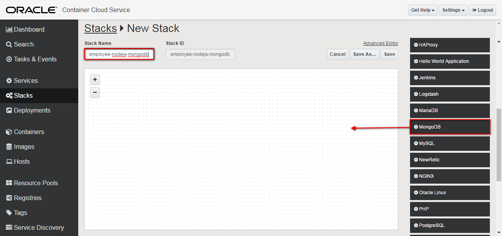

The MongoDB service configuration page opens. Leave the default settings and click **Save**.

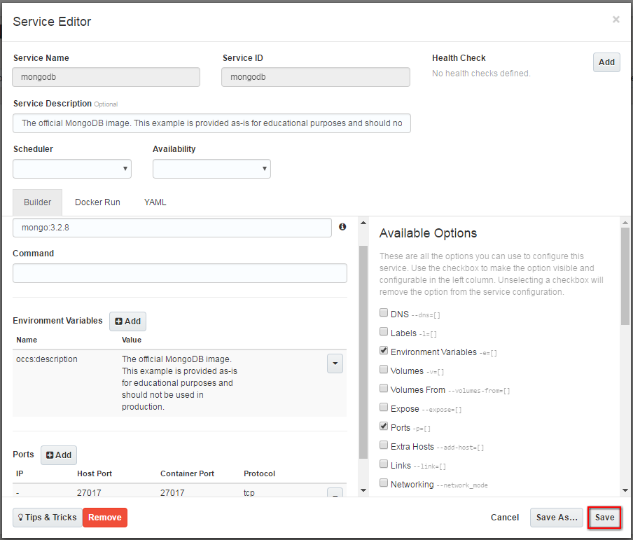

Find the *employee-nodejs* service and drag and drop to the grid area. The service configuration page opens. Check in the **Links** option. Scroll down in the Builder area and click the **+Add** button next to the *Links*.

Here you need to configure the (network) link between the containers. *Service* refers to the defined Container Cloud Service which is MongoDB if you haven't changed the MongoDB configuration in the previous step. Finally *Alias* is the host name of the service. This is what needed to configure MongoDB driver to access MongoDB instance from Node.js sample application service. Click **Save**.

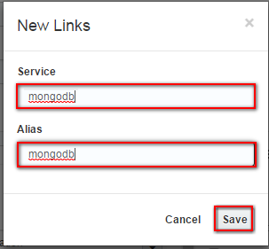

Click **Save** to update *employee-nodejs* configuration for this stack.

Check the diagram and click Save to create *employee-nodejs-mongodb* stack.

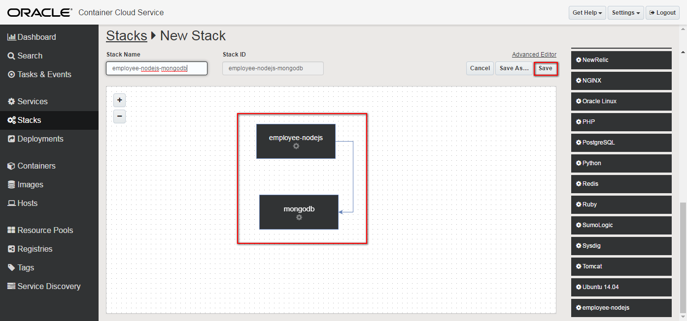

#### Deploy Oracle Container Cloud Stack and test the Employee Node.js sample application ####

Stack is ready, so it is time to deploy and test the Employee Node.js sample application. Find the newly created *employee-nodejs-mongodb* stack and click the green **Deploy** button.

Leave the default configuration for orchestration and click **Deploy**.

The stack deployment detail page opens. Wait until the stack is up and running. Everything should be green except the red Stop button. If you carefully watch the startup process you can see when the Oracle Container Cloud Service pulls the *johnlsmith/nodejs-mongodb-crud* image from Docker hub.

To test the application you need to get the host environment's public IP address. Click on the Hostname where the *employee-nodejs* service deployed.

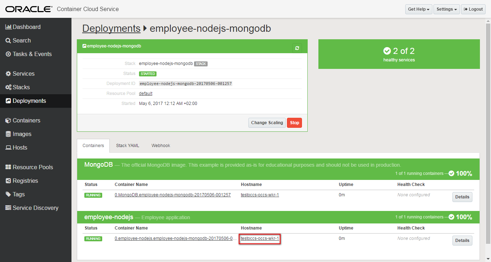

Find and note the public_ip address attribute.

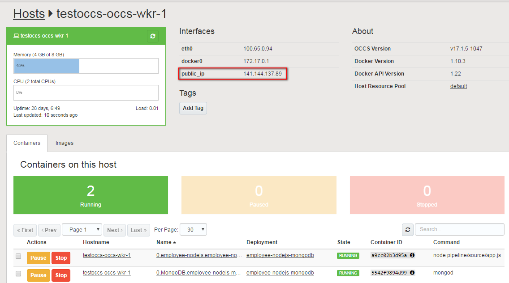

Open a new browser (tab) and enter or copy the host's public IP address and append the configured 8091 port. For example: `141.144.137.89:8091` You have to get the following webpage below. To test MongoDB click **Add New Employee** button.

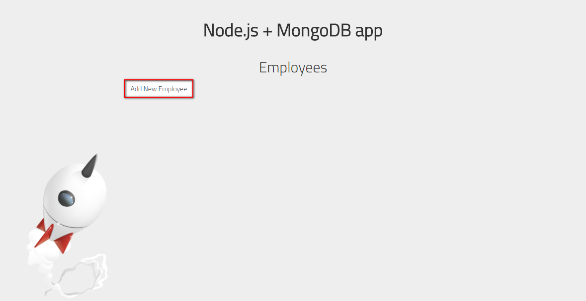

Enter a name, title and **Save**.

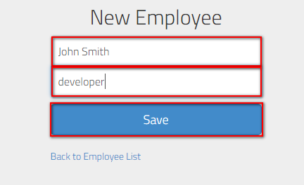

#### Change the Employee Node.js sample application ####

To modify something small on the application's home page open a new browser (tab) and edit for example *https://github.com/<YOUR\_GITHUB\_USERNAME>/nodejs-mongodb-crud/blob/master/views/index.jade* file.Click the Edit icon.

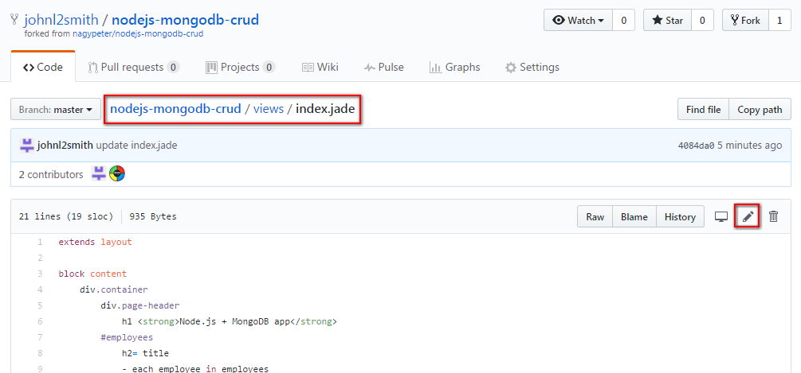

Modify the following part:

	h1 <strong>Node.js + MongoDB app</strong>

Include your name for example:

	h1 <strong>Node.js + MongoDB app running on Oracle Container Cloud</strong>

Enter a commit message and click **Commit changes** button.

Find your browser (tab) where Wercker is already opened and check the progress of the build started by the commit.

When the build and push are done go back to the Oracle Container Cloud Services console and select the Containers item on the left side menu. Find the container which **name** contains *employee-nodejs* string. **Stop** that container.

When the container has stopped DO NOT remove. 

The default configuration of the stack will remove and than immediately deploy again the missing service. Click on the Deployment which name contains *employee-nodejs-mongodb*. (If in the meantime *employee-nodejs* service appears again you can use it's deployment link too since these services are part of the same stack.)

It navigates to the *employee-nodejs-mongodb* stack deployment details page. If you enough quick you can see when Oracle Container Cloud Service pull the new version of the image from Docker hub. Wait until the service is up and running and everything is green on the detail page.

Change the browser (tab) where the Employee sample application was opened and reload the page and check the title changes.

Please note the data still available because MongoDB service runs in a different container.
